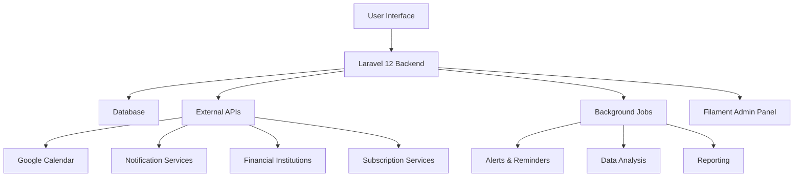
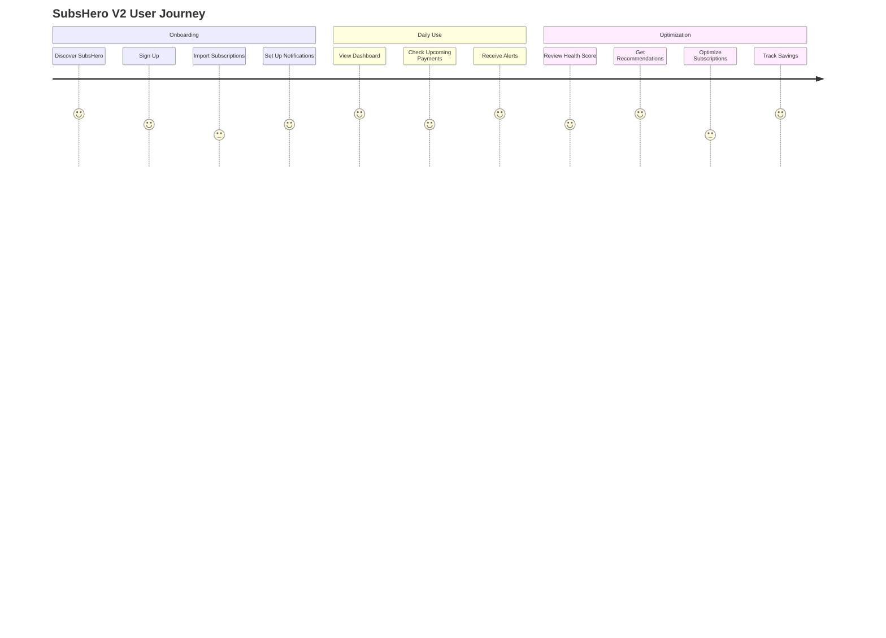
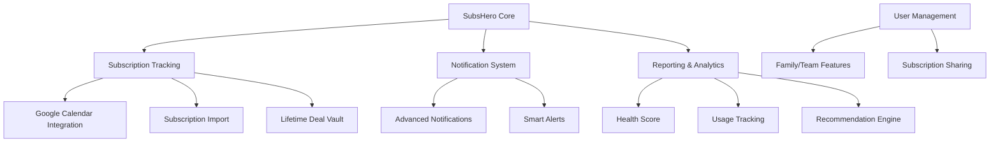

# SubsHero V2 Analysis and Recommendations

## Executive Summary

This document provides a comprehensive analysis of SubsHero's current features, competitor analysis, and recommendations for innovative features to implement in SubsHero V2. The goal is to enhance SubsHero's market position against competitors like subly.app and trackmysubs while focusing on features that are feasible to implement with the Laravel 12 and Filament PHP tech stack.

## Table of Contents

1. [Current Features Analysis](#current-features-analysis)
2. [Competitor Analysis](#competitor-analysis)
3. [Feature Recommendations](#feature-recommendations)
4. [Technical Implementation Considerations](#technical-implementation-considerations)
5. [Feature Prioritization](#feature-prioritization)
6. [Visual Representations](#visual-representations)

## Current Features Analysis

SubsHero currently offers:

- Centralized dashboard for managing all subscriptions
- Automated renewal reminders to avoid late fees
- Customized alerts before bills arrive
- Billing and expense tracking features
- Smart saving features for managing free trials
- Compatibility with Chrome Extension and Mobile Apps

These features provide a solid foundation for subscription management, but there are opportunities to enhance and differentiate SubsHero from competitors.

## Competitor Analysis

### Subly.app

**Key Features:**
- Centralized subscription dashboard
- Detailed spending insights and analytics
- Multi-currency support with automatic conversions
- Categorization and organization of subscriptions
- Payment method tracking
- Upcoming payments calendar view
- Expense reports and visualizations
- Team and project-based subscription management

**Strengths:**
- Clean, modern UI with intuitive visualization
- Strong focus on financial insights and reporting
- Multi-currency support for global users
- Team collaboration features

**Limitations:**
- Limited integration capabilities
- No apparent focus on lifetime deal communities

### TrackMySubs

**Key Features:**
- Client relationship management focus
- Customizable alert system with multiple delivery methods
- Calendar view with 12-month and annual expense visibility
- Zapier integration for connecting with other apps
- CSV import/export functionality
- Organization features with folders, tags, and payment methods
- Specifically designed for digital entrepreneurs and small businesses

**Strengths:**
- Strong focus on client relationship management
- Organizational features for detailed views
- Platform compatibility (Mac, Windows, iOS, Android)
- Free tier for basic usage (10 subscriptions)

**Limitations:**
- Less sophisticated UI compared to Subly
- Limited integrations (Quickbooks and Xero mentioned as "coming soon")
- Less emphasis on data visualization

## Feature Recommendations

Based on the analysis of current features and competitors, here are innovative feature recommendations for SubsHero V2:

### 1. Google Calendar Integration

**Description:** Implement the planned Google Calendar integration to sync all subscription events, payment dates, and renewal reminders to users' Google Calendars.

**Benefits:**
- Provides users with a familiar interface to track subscription deadlines
- Reduces the need to check SubsHero app for upcoming payments
- Enables notifications through Google Calendar's robust reminder system

**Implementation Considerations:**
- Utilize Google Calendar API with Laravel
- Allow users to customize which events sync to their calendar
- Implement two-way sync for changes made in either system

### 2. Lifetime Deal Vault

**Description:** Create a dedicated section for tracking and managing lifetime deals (LTDs), specifically designed for the target audience of Facebook LTD communities and AppSumo users.

**Benefits:**
- Directly addresses the needs of the target demographic
- Differentiates from competitors who don't focus on LTDs
- Creates a unique selling point for SubsHero

**Features:**
- LTD-specific metadata fields (purchase date, platform, original price, etc.)
- ROI calculator for lifetime deals
- Usage tracking to identify underutilized LTDs
- Integration with popular LTD platforms like AppSumo
- Community-sourced database of common LTDs

### 3. Smart Subscription Recommendations

**Description:** Implement an AI-powered system that analyzes user's subscription portfolio and provides recommendations for optimization.

**Benefits:**
- Helps users save money by identifying redundant or underused subscriptions
- Provides additional value beyond basic tracking
- Creates a competitive advantage over simpler tracking tools

**Features:**
- Identify overlapping subscriptions with similar functionality
- Suggest optimal subscription tiers based on usage patterns
- Recommend bundle opportunities to save money
- Alert users to better deals or alternatives

### 4. Subscription Sharing Hub

**Description:** Create a system for users to find and connect with others to share subscription costs for services that allow multiple users.

**Benefits:**
- Helps users save money through subscription sharing
- Creates a community aspect within SubsHero
- Addresses a common need in subscription management

**Features:**
- Anonymous matching system for finding sharing partners
- Templates for subscription sharing agreements
- Payment splitting calculator
- Integrated chat for coordination

### 5. Vendor Negotiation Assistant

**Description:** Provide tools and templates to help users negotiate better deals with subscription vendors.

**Benefits:**
- Empowers users to reduce subscription costs
- Provides value beyond tracking
- Addresses a pain point in subscription management

**Features:**
- Email templates for requesting discounts
- Renewal negotiation reminders
- Historical pricing data to inform negotiations
- Success stories and statistics from other users

### 6. Enhanced Subscription Import System

**Description:** Create a more robust system for automatically detecting and importing subscriptions.

**Benefits:**
- Reduces manual entry burden
- Improves data accuracy
- Simplifies onboarding for new users

**Features:**
- Email scanning option to detect subscription confirmations
- Bank/credit card integration to identify recurring payments
- Browser extension to detect subscription sign-ups in real-time
- Bulk import improvements with smart categorization

### 7. Subscription Health Score

**Description:** Implement a scoring system that rates the overall health and value of a user's subscription portfolio.

**Benefits:**
- Provides quick insights into subscription management effectiveness
- Gamifies the experience of optimizing subscriptions
- Creates a simple metric for tracking improvement

**Features:**
- Overall health score based on multiple factors
- Individual subscription value scores
- Benchmarking against similar users
- Actionable recommendations to improve scores

### 8. Advanced Notification System

**Description:** Expand the current alert system with more channels and customization options.

**Benefits:**
- Ensures users never miss important subscription events
- Accommodates different user preferences
- Improves the core functionality that users rely on

**Features:**
- Support for SMS, WhatsApp, Telegram, and other messaging platforms
- Custom notification schedules (e.g., 7 days, 3 days, and 1 day before renewal)
- Smart escalation for important renewals
- Batch notification options to reduce alert fatigue

### 9. Subscription Usage Tracker

**Description:** Help users track how frequently they use each subscription to identify underutilized services.

**Benefits:**
- Provides data-driven insights for subscription decisions
- Helps identify wasted spending
- Adds value beyond basic subscription tracking

**Features:**
- Manual usage logging
- Integration with service APIs where available
- Usage trends and patterns visualization
- Value calculation based on cost per use

### 10. Family/Team Subscription Management

**Description:** Expand subscription management to handle family or small team scenarios.

**Benefits:**
- Addresses the common need to manage subscriptions across households or small teams
- Expands the potential user base
- Creates opportunities for premium tier offerings

**Features:**
- Subscription sharing and assignment to family/team members
- Permission levels for viewing and managing subscriptions
- Cost splitting and reimbursement tracking
- Usage tracking by member

## Technical Implementation Considerations

Given the specified tech stack of Laravel 12 with Filament PHP, here are implementation considerations for the recommended features:

### Laravel 12 Advantages
- The latest Laravel version provides improved performance and security
- Enhanced Eloquent ORM capabilities for complex data relationships
- Robust queue system for handling background processes like notifications
- Strong ecosystem of packages that can accelerate development

### Filament PHP Integration
- Filament's admin panel capabilities can be leveraged for creating intuitive dashboards
- TALL stack (Tailwind, Alpine.js, Laravel, Livewire) integration simplifies frontend development
- Filament's form builder can streamline subscription management interfaces
- Filament Widgets can be used for data visualization components

### API Integrations
- Google Calendar API for calendar integration
- Financial institution APIs for transaction detection (where available)
- Subscription service APIs for usage data (where available)
- Notification service APIs (Twilio, WhatsApp Business API, etc.)

### Data Structure Considerations
- Flexible metadata fields to accommodate different subscription types
- Robust tagging and categorization system
- Efficient storage of historical data for trend analysis
- Proper relationship modeling for family/team features

## Feature Prioritization

Based on implementation complexity and potential impact, here's a suggested prioritization of the recommended features:

### High Priority (Quick Wins)
1. **Google Calendar Integration** - Already planned and relatively straightforward to implement
2. **Advanced Notification System** - Enhances core functionality with moderate implementation effort
3. **Lifetime Deal Vault** - Directly targets the core audience with moderate complexity

### Medium Priority
4. **Enhanced Subscription Import System** - Improves onboarding but requires more technical integration
5. **Subscription Health Score** - Adds value with moderate implementation complexity
6. **Family/Team Subscription Management** - Expands use cases but requires careful permission modeling

### Lower Priority (More Complex)
7. **Smart Subscription Recommendations** - Higher complexity due to AI/ML requirements
8. **Subscription Usage Tracker** - Requires more complex integrations with third-party services
9. **Vendor Negotiation Assistant** - Content-heavy feature that may require ongoing maintenance
10. **Subscription Sharing Hub** - Complex social features with potential privacy and security considerations

## Visual Representations

### System Architecture Diagram

### User Journey Map

### Feature Relationship Diagram

## Conclusion

SubsHero V2 has significant potential to differentiate itself in the subscription management market by focusing on features that specifically address the needs of lifetime deal communities and AppSumo users. The recommended features balance innovation with feasibility of implementation using the Laravel 12 and Filament PHP tech stack.

By prioritizing the Google Calendar integration, Lifetime Deal Vault, and Advanced Notification System as initial enhancements, SubsHero can quickly deliver value to users while building toward more complex features. This approach will help attract users from competitors while establishing a unique position in the market.

The technical foundation of Laravel 12 and Filament PHP provides a robust platform for implementing these features, with particular advantages in creating intuitive admin interfaces and leveraging the TALL stack for modern web development.
