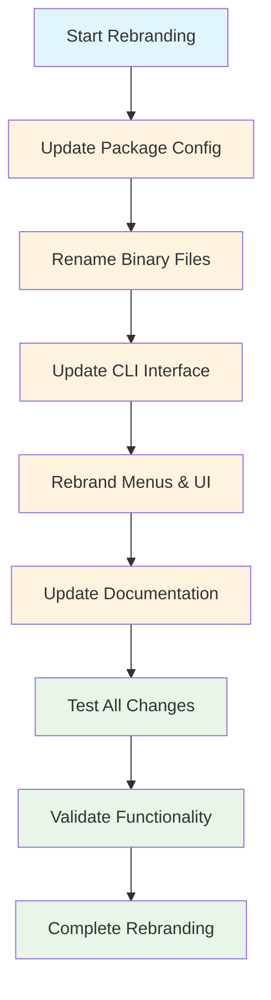

# PRD ID: prd_002

# Title: undefined

# Status: pending

# Priority: medium

# Complexity: medium

# PRD Path: .taskmaster/prd/pending/prd_002_taskhero_ui_rebrand.md

# File Hash: 744710557c9cb26d5346ad5bd42c4468aa53809be98c999fcfce77f26701f8ed

# File Size: 9110 bytes

# Last Modified: 2025-06-03T05:22:21.582Z

# Last Parsed: 2025-06-03T05:22:21.581Z

# TaskHero UI/UX Rebranding PRD

**Document Version:** 1.0  
**Created:** 2025-06-03  
**Last Updated:** 2025-06-03  
**Author:** Development Team  
**Project:** TaskHero UI/UX Rebranding

---

## Table of Contents

1. [Executive Summary](#1-executive-summary)
2. [Project Overview](#2-project-overview)
3. [Technical Requirements](#3-technical-requirements)
4. [Feature Specifications](#4-feature-specifications)
5. [System Architecture](#5-system-architecture)
6. [Implementation Phases](#6-implementation-phases)
7. [Dependencies & Constraints](#7-dependencies--constraints)
8. [Testing & Quality Assurance](#8-testing--quality-assurance)
9. [Deployment & Operations](#9-deployment--operations)
10. [Success Metrics](#10-success-metrics)
11. [System Flow Diagram](#11-system-flow-diagram)

---

## 1. Executive Summary

### 1.1 Project Purpose

**Brief Description:** Rebrand TaskMaster AI to TaskHero AI focusing on UI/UX elements, external-facing components, and user-visible branding while maintaining core functionality and internal architecture.

**Business Value:** Align the product with the published npm package name (task-hero-ai) and create a more heroic, action-oriented brand identity that resonates better with developers and project managers.

**Success Definition:** Complete transformation of all user-facing elements from TaskMaster to TaskHero branding without breaking existing functionality or user workflows.

### 1.2 Key Deliverables

- [ ] **Updated CLI Interface:** All commands, help text, and user messages reflect TaskHero branding
- [ ] **Rebranded Documentation:** All user-facing documentation updated with TaskHero identity
- [ ] **Package Configuration:** npm package properly configured as task-hero-ai with correct binary commands

### 1.3 Timeline & Scope

**Estimated Duration:** 8 days
**Complexity Level:** Medium
**Team Size:** 1-2 developers

---

## 2. Project Overview

### 2.1 Problem Statement

**Current State:** The project currently uses TaskMaster branding internally but has been published to npm as task-hero-ai, creating inconsistency between the package name and the actual user experience.

**Pain Points:**

- **Brand Inconsistency:** Users install task-hero-ai but see TaskMaster throughout the interface
- **Command Confusion:** CLI commands use task-master while package is task-hero-ai
- **Documentation Mismatch:** Documentation references don't align with published package name

### 2.2 Proposed Solution

**Solution Overview:** Systematically update all user-facing elements, CLI commands, documentation, and external references to use TaskHero branding while preserving internal functionality.

**Key Benefits:**

- **Brand Consistency:** Unified TaskHero experience from installation to daily usage
- **User Clarity:** Clear alignment between package name and user interface
- **Professional Identity:** Cohesive brand presence across all touchpoints

### 2.3 Target Users

**Primary Users:** Developers and project managers using the CLI tool
**Secondary Users:** Documentation readers and npm package browsers
**User Personas:** Technical users who value consistency and clear branding

---

## 3. Technical Requirements

### 3.1 Technology Stack

**Backend:** Node.js with ES modules
**Frontend:** CLI interface with Inquirer.js and Chalk
**Package Management:** npm with binary command configuration
**Documentation:** Markdown files
**Configuration:** JSON configuration files

### 3.2 Performance Requirements

**Response Time:** No impact on existing performance
**Compatibility:** Maintain backward compatibility where possible
**Migration:** Smooth transition for existing users

### 3.3 Security Requirements

**No Security Changes:** This is purely a branding update with no security implications

### 3.4 Integration Requirements

**MCP Server:** Update MCP server branding and references
**External APIs:** No changes to external API integrations
**File System:** Update file naming conventions where user-visible

---

## 4. Feature Specifications

### 4.1 Core Features

#### 4.1.1 Feature 1: CLI Command Rebranding

**Description:** Update all CLI commands from task-master to task-hero
**User Story:** As a user, I want to use task-hero commands that match the package name I installed
**Acceptance Criteria:**

- [ ] **AC1:** Binary command changes from task-master to task-hero
- [ ] **AC2:** All help text displays TaskHero instead of TaskMaster
- [ ] **AC3:** Error messages and user feedback use TaskHero branding

#### 4.1.2 Feature 2: Interactive Menu Rebranding

**Description:** Update all interactive menu elements, banners, and UI text
**User Story:** As a user, I want the interactive interface to consistently show TaskHero branding
**Acceptance Criteria:**

- [ ] **AC1:** Menu headers and banners display TaskHero
- [ ] **AC2:** All menu options and descriptions use TaskHero terminology
- [ ] **AC3:** Status messages and confirmations reflect TaskHero branding

#### 4.1.3 Feature 3: Documentation Update

**Description:** Comprehensive update of all user-facing documentation
**User Story:** As a user, I want documentation that accurately reflects the TaskHero brand and commands
**Acceptance Criteria:**

- [ ] **AC1:** README files updated with TaskHero branding and correct commands
- [ ] **AC2:** Installation instructions reference task-hero-ai package
- [ ] **AC3:** All examples and code snippets use task-hero commands

---

## 6. Implementation Phases

### 6.1 Phase 1: Package & Binary Configuration (Day 1-2)

**Objective:** Update core package configuration and binary commands
**Deliverables:**

- [ ] **Task 1.1:** Update package.json with TaskHero branding and task-hero binary
- [ ] **Task 1.2:** Rename bin/task-master.js to bin/task-hero.js
- [ ] **Task 1.3:** Update MCP server configuration files with TaskHero references

**Success Criteria:** npm package installs correctly with task-hero command available

### 6.2 Phase 2: CLI Interface Updates (Day 3-5)

**Objective:** Transform all CLI interface elements to TaskHero branding
**Deliverables:**

- [ ] **Task 2.1:** Update all CLI command help text and descriptions
- [ ] **Task 2.2:** Rebrand interactive menu system headers and options
- [ ] **Task 2.3:** Update error messages and user feedback strings

**Success Criteria:** All user-visible CLI elements display TaskHero branding

### 6.3 Phase 3: Documentation & External References (Day 6-7)

**Objective:** Update all documentation and external-facing content
**Deliverables:**

- [ ] **Task 3.1:** Update README.md and all documentation files
- [ ] **Task 3.2:** Update installation and usage examples
- [ ] **Task 3.3:** Update template files and example configurations

**Success Criteria:** All documentation accurately reflects TaskHero branding and commands

### 6.4 Phase 4: Testing & Validation (Day 8)

**Objective:** Ensure all changes work correctly and maintain functionality
**Deliverables:**

- [ ] **Task 4.1:** Test all CLI commands with new task-hero binary
- [ ] **Task 4.2:** Validate interactive menu functionality
- [ ] **Task 4.3:** Verify documentation accuracy and link integrity

**Success Criteria:** All functionality works correctly with TaskHero branding

---

## 7. Dependencies & Constraints

### 7.1 Technical Dependencies

**External Dependencies:**

- **npm Registry:** task-hero-ai package name must remain available
- **Node.js:** Maintain compatibility with existing Node.js versions

**Internal Dependencies:**

- **Existing Functionality:** All current features must continue working
- **Configuration Files:** User configuration files should migrate smoothly

### 7.2 Resource Constraints

**Scope Limitation:** Focus only on UI/UX and external branding, not internal architecture
**Backward Compatibility:** Minimize breaking changes for existing users
**Time Constraint:** Complete within 8-day timeline

---

## 8. Testing & Quality Assurance

### 8.1 Testing Strategy

**Functional Testing:** Verify all CLI commands work with new branding
**User Experience Testing:** Ensure consistent TaskHero experience throughout
**Documentation Testing:** Validate all examples and instructions are accurate

### 8.2 Quality Gates

**Brand Consistency:** 100% of user-facing elements use TaskHero branding
**Functionality Preservation:** All existing features continue to work
**Documentation Accuracy:** All examples and commands are correct

---

## 11. System Flow Diagram

### 11.1 Rebranding Process Flow

---

**Document Status:** Draft
**Next Review Date:** 2025-06-04
**Approval Required From:** Development Team Lead
