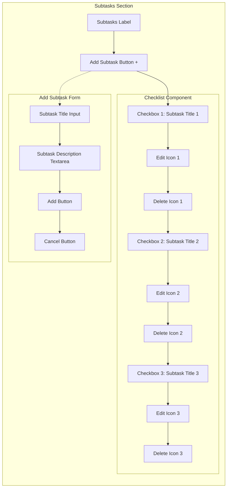
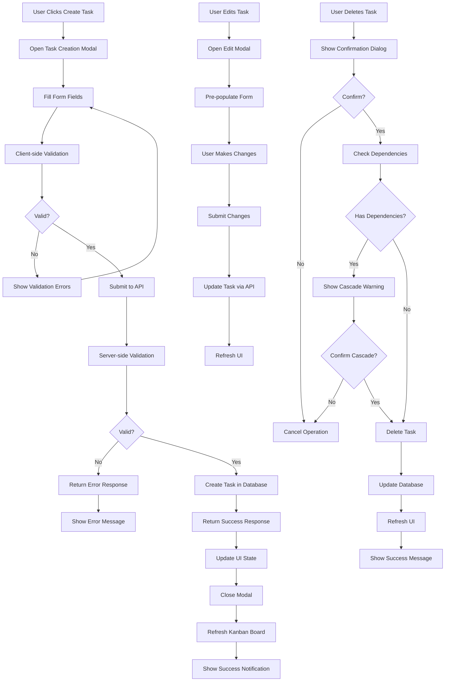
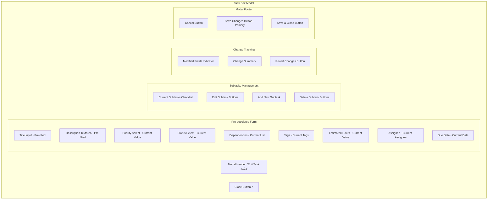

# TaskHero Kanban CRUD Implementation

## Context

### Overview  
Implement comprehensive CRUD (Create, Read, Update, Delete) operations for the TaskHero Enhanced Kanban Board web application. This will enable users to manage tasks directly through the web interface using modern UI components, eliminating the need to switch between CLI and web interfaces for task management.

The current kanban board displays tasks beautifully with rich metadata, but lacks the ability to create, edit, or delete tasks. Users must use CLI commands for these operations, creating a fragmented user experience.

### Core Features  

#### Task Creation Modal
- Modern modal dialog using shadcn/ui components
- Form fields for all task properties (title, description, priority, dependencies, etc.)
- Real-time validation and error handling
- Integration with existing TaskHero task structure
- Support for manual task creation and AI-assisted task generation

#### Task Editing Interface
- In-place editing capabilities for task cards
- Full-featured edit modal for complex changes
- Bulk editing operations for multiple tasks
- Status updates via drag-and-drop (already implemented)
- Dependency management through visual interface

#### Task Deletion System
- Confirmation dialogs for safe deletion
- Cascade deletion handling for tasks with subtasks
- Dependency cleanup when tasks are removed
- Undo functionality for accidental deletions

#### Enhanced Task Display
- Improved task cards with action buttons
- Context menus for quick operations
- Keyboard shortcuts for power users
- Real-time updates across all connected clients

### User Experience  

#### User Personas
- **Project Managers**: Need quick task creation and bulk operations
- **Developers**: Want keyboard shortcuts and efficient workflows  
- **Team Members**: Require intuitive interface for status updates

#### Key User Flows
1. **Quick Task Creation**: Click "+" button → Fill form → Save → Task appears in appropriate column
2. **Task Editing**: Click task → Edit in modal → Save → Changes reflected immediately
3. **Task Deletion**: Right-click task → Delete → Confirm → Task removed with dependency cleanup
4. **Bulk Operations**: Select multiple tasks → Apply action → Confirm → Batch processing

#### UI/UX Considerations
- Consistent with existing TaskHero design language
- Responsive design for mobile and desktop
- Accessibility compliance (WCAG 2.1 AA)
- Progressive enhancement for offline capabilities

## PRD

### Technical Architecture  

#### System Components

##### Frontend Components (React + shadcn/ui)
- **TaskCreateModal**: Main task creation interface
- **TaskEditModal**: Comprehensive task editing interface  
- **TaskDeleteDialog**: Confirmation and cascade handling
- **TaskActionMenu**: Context menu for task operations
- **BulkOperationsToolbar**: Multi-select task management
- **FormComponents**: Reusable form fields for task properties

##### Backend API Extensions
- Enhanced REST endpoints for full CRUD operations
- Validation middleware for task data integrity
- Real-time WebSocket updates for live collaboration
- Batch operation endpoints for bulk actions
- File upload support for task attachments

##### Data Models
```typescript
interface TaskFormData {
  title: string;
  description: string;
  priority: 'low' | 'medium' | 'high';
  status: TaskStatus;
  dependencies: string[];
  tags: string[];
  estimatedHours?: number;
  assignee?: string;
  dueDate?: Date;
  attachments?: File[];
}

interface BulkOperation {
  taskIds: string[];
  operation: 'delete' | 'updateStatus' | 'updatePriority' | 'addDependency';
  payload: any;
}
```

#### APIs and Integrations
- Extend existing `/api/v1/tasks` endpoints
- WebSocket integration for real-time updates
- File upload service for task attachments
- Integration with TaskHero CLI commands via MCP server
- Validation using existing TaskHero business rules

#### Infrastructure Requirements
- Enhanced error handling and logging
- Rate limiting for API endpoints
- File storage for task attachments
- Real-time notification system
- Backup and recovery for task data

### Task Creation Modal Form Layout

```mermaid
graph TB
    subgraph "Task Creation Modal"
        A[Modal Header: 'Create New Task']
        B[Close Button X]
        
        subgraph "Form Section 1: Basic Info"
            C[Title Input - Required]
            D[Description Textarea - Required]
            E[Priority Select: Low/Medium/High]
            F[Status Select: Pending/In-Progress/Done/Review/Blocked]
        end
        
        subgraph "Form Section 2: Advanced"
            G[Dependencies Multi-Select with Search]
            H[Tags Input with Autocomplete]
            I[Estimated Hours Number Input]
            J[Assignee Select/Input]
            K[Due Date Picker]
        end
        
        subgraph "Form Section 3: AI Assistance"
            L[AI Generation Toggle]
            M[AI Prompt Textarea - when enabled]
            N[Research Mode Checkbox]
        end
        
        subgraph "Form Section 4: Subtasks"
            O[Subtasks Checklist Component]
            P[Add Subtask Button]
            Q[Subtask Items with Delete]
        end
        
        subgraph "Form Section 5: Attachments"
            R[File Upload Area]
            S[Uploaded Files List]
        end
        
        subgraph "Modal Footer"
            T[Cancel Button]
            U[Save Draft Button]
            V[Create Task Button - Primary]
        end
    end
    
    A --> C
    C --> D
    D --> E
    E --> F
    F --> G
    G --> H
    H --> I
    I --> J
    J --> K
    K --> L
    L --> M
    M --> N
    N --> O
    O --> P
    P --> Q
    Q --> R
    R --> S
    S --> T
    T --> U
    U --> V
```



### Subtasks Implementation with shadcn Checklist



### Development Roadmap

#### Phase 1: Foundation (MVP)

##### Task Creation Modal
- Basic modal with essential fields (title, description, priority)
- Form validation and error handling
- Integration with existing API endpoints
- Simple success/error notifications

##### Task Editing Interface
- Click-to-edit functionality for task cards
- Modal-based editing for complex properties
- Real-time validation and save functionality
- Integration with existing task update APIs

#### Phase 2: Enhanced Operations

##### Task Deletion System
- Confirmation dialogs with dependency warnings
- Cascade deletion for subtasks
- Dependency cleanup automation
- Undo functionality with time-limited recovery

##### Advanced Form Features
- Dependency selection with visual picker
- Tag management with autocomplete
- Date picker for due dates
- File upload for attachments

#### Phase 3: Bulk Operations & UX Polish

##### Bulk Operations
- Multi-select functionality for task cards
- Bulk status updates
- Bulk deletion with confirmation
- Bulk dependency management

##### Enhanced User Experience
- Keyboard shortcuts for all operations
- Context menus for quick actions
- Drag-and-drop for dependency creation
- Advanced filtering and search

#### Phase 4: Real-time & Collaboration

##### Real-time Updates
- WebSocket integration for live updates
- Conflict resolution for concurrent edits
- Real-time notifications for team members
- Optimistic UI updates with rollback

##### Advanced Features
- Task templates for quick creation
- Recurring task creation
- Task history and audit trail
- Advanced reporting and analytics

### Logical Dependency Chain

#### Foundation Dependencies
1. **API Enhancement**: Extend existing REST endpoints for full CRUD support
2. **Form Infrastructure**: Create reusable form components using shadcn/ui
3. **Modal System**: Implement base modal components for task operations
4. **Validation Layer**: Implement client-side and server-side validation

#### Feature Dependencies
1. **Task Creation** → **Task Editing** → **Task Deletion**
2. **Basic Operations** → **Bulk Operations** → **Advanced Features**
3. **Static UI** → **Real-time Updates** → **Collaboration Features**
4. **Core Functionality** → **UX Enhancements** → **Advanced Workflows**

#### Integration Dependencies
1. **Frontend Components** → **API Integration** → **Real-time Updates**
2. **Form Validation** → **Error Handling** → **User Feedback**
3. **Basic CRUD** → **Dependency Management** → **Cascade Operations**

### Risks and Mitigations

#### Technical Challenges
- **Risk**: Complex form validation for task dependencies
- **Mitigation**: Implement progressive validation with clear error messages

- **Risk**: Real-time update conflicts between multiple users
- **Mitigation**: Implement optimistic updates with conflict resolution

- **Risk**: Performance issues with large task datasets
- **Mitigation**: Implement pagination, virtual scrolling, and efficient state management

#### MVP Scope Management
- **Risk**: Feature creep leading to delayed delivery
- **Mitigation**: Strict adherence to phase-based development with clear acceptance criteria

- **Risk**: Integration complexity with existing TaskHero CLI
- **Mitigation**: Leverage existing MCP server architecture for consistent behavior

#### Resource Constraints
- **Risk**: UI/UX complexity requiring specialized design skills
- **Mitigation**: Use proven shadcn/ui components and established design patterns

- **Risk**: Testing complexity for CRUD operations
- **Mitigation**: Implement comprehensive test suite with automated validation

### Appendix

#### Research Findings
- Current API endpoints support all required CRUD operations
- shadcn/ui provides all necessary components for forms and modals
- Existing drag-and-drop system can be extended for dependency management
- TaskHero MCP server architecture supports real-time integration

#### Technical Specifications

##### Required shadcn/ui Components
- Dialog, Form, Input, Textarea, Select, Button, Checkbox
- Popover, Command, Badge, Alert, Toast
- Calendar, DatePicker (for due dates)
- DropdownMenu, ContextMenu (for actions)

##### API Endpoint Extensions
- Enhanced validation for POST/PUT operations
- Batch operation endpoints for bulk actions
- File upload endpoints for attachments
- WebSocket endpoints for real-time updates

##### Performance Requirements
- Form submission response time < 500ms
- Real-time update propagation < 100ms
- Bulk operations support up to 100 tasks
- Responsive UI for datasets up to 1000 tasks

#### CRUD Operations Flow Diagram



#### Task Edit Modal Layout


