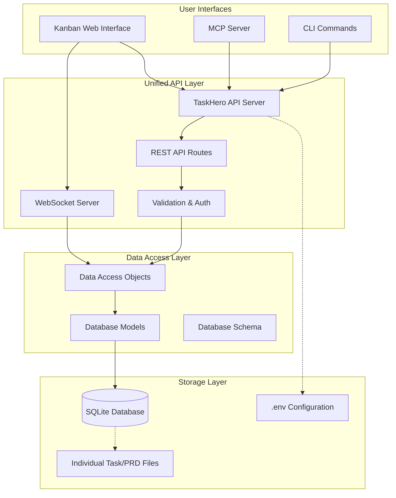
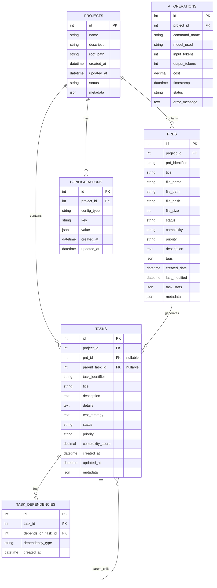

# PRD: TaskHero SQLite Database Implementation

## Metadata
- **PRD ID**: prd_sqlite_implementation
- **Title**: TaskHero SQLite Database Implementation
- **Status**: pending
- **Priority**: high
- **Complexity**: high
- **Created Date**: 2025-01-08
- **Estimated Effort**: 3-4 weeks
- **Tags**: [database, sqlite, architecture, api-unification, hard-reset]

## Executive Summary

Implement SQLite database as the primary data storage for TaskHero, replacing JSON file-based storage. This is a hard reset implementation that will unify the data access layer, improve performance, and create a single API layer that CLI, MCP server, and kanban web interface will consume.

## Problem Statement

Currently, TaskHero suffers from:
- **Distributed Logic**: CLI, MCP, and kanban app have separate data access implementations
- **Data Inconsistency**: Multiple JSON files (tasks.json, prds.json, config.json) can become out of sync
- **Performance Issues**: File I/O operations for every data access
- **Scalability Limitations**: JSON parsing becomes slow with large datasets
- **Concurrency Problems**: Multiple processes can corrupt JSON files
- **Complex Maintenance**: Logic scattered across different layers
- **No Transaction Support**: Cannot ensure data consistency across related operations

## Goals

### Primary Goals
1. **Unified Data Layer**: Single SQLite database for all metadata and configuration
2. **API-First Architecture**: All interfaces (CLI, MCP, Kanban Web) consume unified API
3. **Performance Improvement**: Faster data access and queries
4. **Data Integrity**: ACID transactions and referential integrity
5. **Command Compatibility**: Maintain existing CLI commands and workflows
6. **Hard Reset Implementation**: Clean implementation without migration complexity

### Secondary Goals
1. **Enhanced Analytics**: Better reporting capabilities with SQL queries
2. **Concurrent Access**: Safe multi-user/multi-process operations
3. **Future Scalability**: Foundation for potential PostgreSQL/MySQL migration
4. **Real-time Updates**: WebSocket support for kanban board real-time updates

## Architecture Overview



## Database Schema



## Implementation Phases

### Phase 1: Database Foundation (Week 1)
- **Task 1.1**: Create SQLite database schema with proper indexes and constraints
- **Task 1.2**: Implement database connection manager with connection pooling
- **Task 1.3**: Create Data Access Objects (DAOs) for tasks, PRDs, and configurations
- **Task 1.4**: Build database initialization utilities for new projects
- **Task 1.5**: Implement database backup and restore functionality

### Phase 2: API Layer Development (Week 1-2)
- **Task 2.1**: Design unified REST API endpoints with OpenAPI specification
- **Task 2.2**: Implement task management API (CRUD, status updates, dependencies)
- **Task 2.3**: Implement PRD management API (lifecycle, task linking, statistics)
- **Task 2.4**: Implement configuration management API (AI models, project settings)
- **Task 2.5**: Add comprehensive validation, error handling, and logging middleware
- **Task 2.6**: Implement WebSocket server for real-time kanban updates

### Phase 3: Interface Implementation (Week 2-3)
- **Task 3.1**: Update CLI commands to use unified API instead of direct file access
- **Task 3.2**: Update MCP server to proxy requests through unified API
- **Task 3.3**: Update kanban web interface to use unified API endpoints
- **Task 3.4**: Implement real-time updates for kanban board via WebSocket
- **Task 3.5**: Create API client libraries for consistent interface integration

### Phase 4: Integration & Testing (Week 3-4)
- **Task 4.1**: Integrate all components and ensure seamless operation
- **Task 4.2**: Implement comprehensive test suite (unit, integration, e2e)
- **Task 4.3**: Create performance benchmarks and optimization
- **Task 4.4**: Complete documentation and deployment preparation
- **Task 4.5**: Validate all existing TaskHero workflows work correctly

## Technical Requirements

### Database Requirements
- **SQLite Version**: 3.35+ with JSON support and WAL mode
- **Location**: `.taskmaster/taskhero.db`
- **Initialization**: Auto-create on `task-hero init` with schema versioning
- **Migrations**: Version-controlled schema updates with rollback support
- **Backup**: Automated backup before migrations and daily snapshots
- **Indexes**: Optimized indexes for common query patterns
- **Constraints**: Foreign key constraints and check constraints for data integrity

### API Requirements
- **Framework**: Express.js with TypeScript and strict type checking
- **Port**: Configurable (default: 3001, fallback to available port)
- **Authentication**: JWT token-based for multi-user scenarios
- **Validation**: Zod schema validation with detailed error messages
- **Error Handling**: Standardized error responses with error codes
- **Logging**: Structured logging with Winston and request correlation IDs
- **Documentation**: Auto-generated OpenAPI/Swagger documentation
- **Testing**: Jest test suite with >90% coverage

### Performance Requirements
- **Response Time**: <100ms for simple queries, <500ms for complex operations
- **Concurrent Users**: Support 20+ simultaneous operations safely
- **Database Size**: Handle 50,000+ tasks and 1,000+ PRDs efficiently
- **Memory Usage**: <100MB additional overhead for API server
- **Caching**: In-memory caching for frequently accessed data

### File Structure
```
C:\laragon\www\taskmaster-ai\
├── .taskmaster/
│   ├── taskhero.db              # SQLite database file
│   ├── taskhero.db.backup       # Latest backup
│   ├── config.json              # Legacy config (will be deprecated)
│   ├── tasks/                   # Individual task files (preserved)
│   ├── prd/                     # Individual PRD files (preserved)
│   ├── reports/                 # Generated reports (preserved)
│   └── templates/               # Project templates
├── api/                         # NEW: Unified API server
│   ├── server.js               # Main API server
│   ├── routes/                 # API route handlers
│   │   ├── tasks.js
│   │   ├── prds.js
│   │   ├── config.js
│   │   └── analytics.js
│   ├── models/                 # Database models
│   ├── dao/                    # Data Access Objects
│   ├── middleware/             # Express middleware
│   ├── websocket/              # WebSocket handlers
│   └── utils/                  # API utilities
├── scripts/                     # Existing CLI scripts
├── src/                         # Existing source code
├── tests/                       # Existing test files
├── assets/                      # Existing assets
├── bin/                         # Existing binary files
├── kanban-app/                  # Existing kanban web interface
│   └── src/api/                # Will be updated to use /api
├── mcp-server/                  # Existing MCP server
│   └── src/                    # Will be updated to use /api
├── package.json
├── .env                        # API keys (preserved)
└── README.md
```

## Implementation Strategy

### Hard Reset Approach
1. **Clean Implementation**: Build SQLite system from scratch without migration complexity
2. **API-First**: Build unified API layer as foundation
3. **Interface Updates**: Update CLI/MCP/Kanban to use API
4. **Data Initialization**: Fresh start with empty database, populated via normal TaskHero workflows
5. **Testing**: Comprehensive testing of new implementation

### Development Approach
1. **Database Schema**: Create comprehensive SQLite schema
2. **API Development**: Build REST API with all required endpoints
3. **Interface Integration**: Update existing interfaces to use API
4. **Real-time Features**: Add WebSocket support for kanban board
5. **Documentation**: Complete API and integration documentation

## Success Criteria

### Functional Requirements
- [ ] All existing CLI commands work unchanged
- [ ] MCP server maintains full compatibility
- [ ] Kanban web interface functions with improved performance
- [ ] Real-time updates work seamlessly
- [ ] All TaskHero workflows operate correctly
- [ ] Performance improves by 50%+

### Non-Functional Requirements
- [ ] Clean implementation without migration complexity
- [ ] Command compatibility maintained
- [ ] Documentation updated
- [ ] Test coverage >90%
- [ ] Error handling comprehensive
- [ ] Logging and monitoring in place
- [ ] WebSocket real-time updates functional

## Risks and Mitigation

### High Risk
- **Data Loss**: Comprehensive backup and validation
- **Performance Regression**: Benchmarking and optimization
- **Interface Breaking**: Extensive testing and gradual rollout

### Medium Risk
- **Migration Complexity**: Detailed migration scripts and testing
- **Concurrent Access**: Proper locking and transaction handling
- **Schema Evolution**: Version-controlled migrations

### Low Risk
- **SQLite Limitations**: Well-documented limitations, future migration path
- **Disk Space**: Monitoring and cleanup procedures

## API Endpoints Specification

### Task Management API
- `GET /api/tasks` - List all tasks with filtering and pagination
- `GET /api/tasks/:id` - Get specific task with subtasks and dependencies
- `POST /api/tasks` - Create new task with validation
- `PUT /api/tasks/:id` - Update task (title, description, status, etc.)
- `DELETE /api/tasks/:id` - Delete task and handle dependencies
- `POST /api/tasks/:id/subtasks` - Add subtask to parent task
- `PUT /api/tasks/:id/status` - Update task status with validation
- `POST /api/tasks/:id/dependencies` - Add task dependency
- `DELETE /api/tasks/:id/dependencies/:depId` - Remove dependency

### PRD Management API
- `GET /api/prds` - List all PRDs with status and statistics
- `GET /api/prds/:id` - Get specific PRD with linked tasks
- `POST /api/prds` - Create new PRD entry
- `PUT /api/prds/:id` - Update PRD metadata
- `DELETE /api/prds/:id` - Archive PRD and handle linked tasks
- `POST /api/prds/:id/parse` - Parse PRD and generate tasks
- `GET /api/prds/:id/tasks` - Get all tasks linked to PRD
- `PUT /api/prds/:id/status` - Update PRD status

### Configuration API
- `GET /api/config` - Get all configuration settings
- `GET /api/config/:type` - Get specific configuration type
- `PUT /api/config/:type` - Update configuration settings
- `GET /api/models` - Get AI model configurations
- `PUT /api/models` - Update AI model settings

### Analytics API
- `GET /api/analytics/complexity` - Get complexity analysis reports
- `GET /api/analytics/operations` - Get AI operation statistics
- `POST /api/analytics/complexity` - Generate new complexity report
- `GET /api/analytics/dashboard` - Get dashboard statistics

## Dependencies

### Internal Dependencies
- Current TaskHero codebase and command structure
- Existing JSON data files (tasks.json, prds.json, config.json)
- CLI commands and interactive menu system
- MCP server implementation and direct functions
- Web interface and kanban board components

### External Dependencies
- **better-sqlite3**: High-performance SQLite3 bindings
- **Express.js**: Web framework for API server
- **Zod**: TypeScript-first schema validation
- **Winston**: Logging framework
- **Jest**: Testing framework
- **Swagger/OpenAPI**: API documentation
- **cors**: Cross-origin resource sharing
- **helmet**: Security middleware

## Timeline

- **Week 1**: Database foundation and API development
- **Week 2**: Interface migration and integration
- **Week 3**: Migration tools and testing
- **Week 4**: Documentation, deployment, and validation

## Acceptance Criteria

### Implementation Criteria
1. **Clean Database Schema**: SQLite database with proper schema, indexes, and constraints
2. **Data Structure**: All TaskHero entities (tasks, PRDs, configurations) properly modeled
3. **API Completeness**: Full REST API covering all TaskHero operations
4. **Real-time Support**: WebSocket implementation for kanban board updates

### Interface Compatibility Criteria
5. **CLI Compatibility**: All existing CLI commands work without syntax changes
6. **MCP Compatibility**: MCP server maintains full API compatibility with existing tools
7. **Kanban Interface**: Kanban web interface functions with improved performance and real-time updates
8. **Workflow Preservation**: All existing TaskHero workflows work correctly

### Performance Criteria
9. **Response Time**: 50% improvement in data access operations
10. **Concurrent Access**: Support for 20+ simultaneous operations without conflicts
11. **Memory Efficiency**: API server uses <100MB additional memory
12. **Database Size**: Efficient storage with <20% overhead compared to JSON files

### Technical Criteria
13. **API Coverage**: Complete REST API with >95% endpoint coverage
14. **Error Handling**: Comprehensive error handling with meaningful messages
15. **Logging**: Structured logging for all operations with correlation IDs
16. **Documentation**: Complete API documentation with examples
17. **Testing**: >90% test coverage for all new components
18. **Security**: Proper input validation and SQL injection prevention

### Operational Criteria
19. **Database Initialization**: Automated database creation on project init
20. **Backup Strategy**: Automated backup and restore functionality
21. **Monitoring**: Health checks and performance monitoring endpoints
22. **Deployment**: Clean deployment process with validation

## Implementation Notes

### Database Design Decisions
- **SQLite Choice**: Chosen for simplicity, zero-configuration, and single-file deployment
- **JSON Columns**: Used for flexible metadata storage while maintaining query performance
- **Indexes**: Strategic indexing on frequently queried columns (status, project_id, created_at)
- **Constraints**: Foreign key constraints ensure referential integrity

### API Design Principles
- **RESTful Design**: Standard HTTP methods and status codes
- **Consistent Responses**: Standardized response format with data, meta, and error fields
- **Pagination**: Cursor-based pagination for large datasets
- **Filtering**: Flexible filtering with query parameters
- **Versioning**: API versioning strategy for future compatibility

### Implementation Strategy Details
- **Clean Approach**: Fresh implementation without migration complexity
- **API-First**: Build unified API as foundation for all interfaces
- **Validation**: Comprehensive validation for all data operations
- **Testing**: Thorough testing of all components and integrations

### Future Considerations
- **Database Scaling**: Design allows future migration to PostgreSQL/MySQL
- **Multi-tenancy**: Schema supports multiple projects and users
- **Real-time Updates**: WebSocket support for real-time kanban updates
- **Caching**: Redis integration for improved performance
- **Backup**: Integration with cloud backup services

This implementation will transform TaskHero into a more robust, scalable, and maintainable system while preserving all existing functionality and user workflows. The unified API architecture will enable better integration, improved performance, real-time updates, and easier maintenance across all interfaces.
