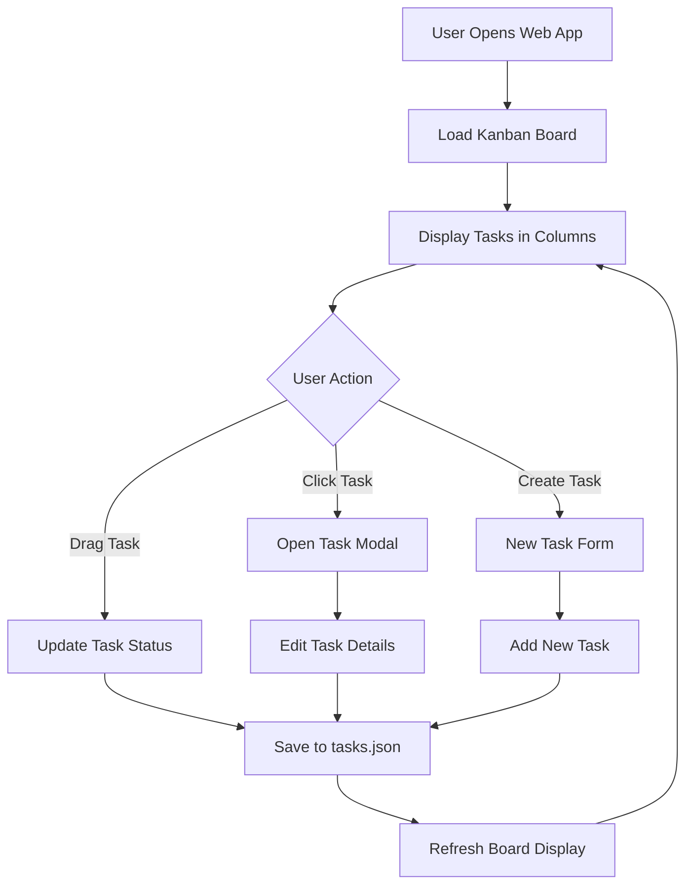
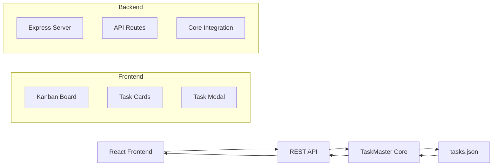

# PRD: TaskMaster Kanban Web Application

**Document Version:** 1.0  
**Created:** 2025-06-02  
**Last Updated:** 2025-06-02  
**Author:** TaskMaster AI Development Team  
**Project:** TaskMaster Kanban Web Application

---

## Table of Contents

1. [Executive Summary](#1-executive-summary)
2. [Project Overview](#2-project-overview)
3. [Technical Requirements](#3-technical-requirements)
4. [Feature Specifications](#4-feature-specifications)
5. [System Architecture](#5-system-architecture)
6. [Implementation Phases](#6-implementation-phases)
7. [Dependencies & Constraints](#7-dependencies--constraints)
8. [Testing & Quality Assurance](#8-testing--quality-assurance)
9. [Deployment & Operations](#9-deployment--operations)
10. [Success Metrics](#10-success-metrics)
11. [System Flow Diagram](#11-system-flow-diagram)

---

## 1. Executive Summary

### 1.1 Project Purpose

**Brief Description:** Develop a modern, responsive web-based Kanban board application that seamlessly integrates with TaskMaster's existing task management system, providing users with an intuitive drag-and-drop interface for visual task management without requiring authentication.

**Business Value:** Enhances TaskMaster's usability by providing a visual, web-based interface that complements the existing CLI tools, making task management more accessible to users who prefer graphical interfaces while maintaining full integration with the core TaskMaster ecosystem.

**Success Definition:** A fully functional web application that allows users to view, manage, and update TaskMaster tasks through an intuitive Kanban interface, with seamless synchronization to the existing tasks.json data structure.

### 1.2 Key Deliverables

- [ ] **React-based Kanban Web Application:** Modern, responsive UI using shadcn/ui components
- [ ] **REST API Layer:** Dedicated Node.js API server connecting to TaskMaster core functions
- [ ] **Drag-and-Drop Functionality:** Intuitive task movement between status columns
- [ ] **Rich Text Editor Integration:** Enhanced task content editing capabilities
- [ ] **Real-time Task Synchronization:** Seamless integration with existing TaskMaster data

### 1.3 Timeline & Scope

**Estimated Duration:** 12 days (24 tasks across 4 phases)
**Complexity Level:** High (14 high-complexity tasks, 10 medium/low-complexity tasks)
**Team Size:** 1-2 developers
**Task Distribution:** Phase 1 (6 tasks), Phase 2 (8 tasks), Phase 3 (6 tasks), Phase 4 (4 tasks)

---

## 2. Project Overview

### 2.1 Problem Statement

**Current State:** TaskMaster currently provides excellent CLI-based task management with a terminal Kanban view, but lacks a modern web interface that can be easily shared, accessed remotely, or used by team members who prefer graphical interfaces.

**Pain Points:**

- **Limited Accessibility:** CLI interface requires technical knowledge and terminal access
- **No Remote Access:** Cannot easily view or manage tasks from different devices or locations
- **Team Collaboration:** Difficult to share task boards with non-technical stakeholders
- **Visual Limitations:** Terminal-based Kanban has display constraints and limited interactivity

### 2.2 Proposed Solution

**Solution Overview:** Create a modern web application that provides a visual Kanban interface for TaskMaster tasks, featuring drag-and-drop functionality, rich text editing, and real-time synchronization with the existing TaskMaster backend through a dedicated REST API layer.

**Key Benefits:**

- **Enhanced Accessibility:** Web-based interface accessible from any device with a browser
- **Improved User Experience:** Modern, intuitive drag-and-drop interface with rich visual feedback
- **Better Collaboration:** Easily shareable localhost URL for team access during development
- **Seamless Integration:** Full compatibility with existing TaskMaster CLI tools and data structures

### 2.3 Target Users

**Primary Users:** TaskMaster users who prefer visual task management interfaces  
**Secondary Users:** Development team members and stakeholders who need task visibility  
**User Personas:** Developers, project managers, and team leads working with TaskMaster projects

---

## 3. Technical Requirements

### 3.1 Technology Stack

**Backend:** Node.js with Express.js framework, leveraging existing TaskMaster core functions  
**Frontend:** React 18+ with TypeScript, shadcn/ui component library, Tailwind CSS  
**Drag & Drop:** @dnd-kit/core library for accessible drag-and-drop functionality  
**Rich Text Editor:** Tiptap editor for enhanced content editing  
**Build Tools:** Vite for fast development and optimized production builds  
**Data Storage:** Existing tasks.json file structure, optional additional JSON files for webapp-specific data

### 3.2 Performance Requirements

**Response Time:** < 200ms for task operations, < 500ms for initial load  
**Throughput:** Support for 100+ tasks without performance degradation  
**Concurrent Users:** 1-5 users (localhost development environment)  
**Uptime:** 99% availability during development sessions  
**Scalability:** Designed for easy transition to multi-user deployment

### 3.3 Security Requirements

**Authentication:** None required (localhost development environment)  
**Authorization:** File system access controls only  
**Data Protection:** Local file system security, no external data transmission  
**Compliance:** No specific regulatory requirements  
**Security Standards:** Standard localhost security practices

### 3.4 Integration Requirements

**External APIs:** None required  
**Data Sources:** TaskMaster tasks.json, PRD metadata files  
**Data Destinations:** TaskMaster tasks.json updates via REST API  
**Real-time Requirements:** Near real-time task updates and status synchronization

---

## 4. Feature Specifications

### 4.1 Core Features

#### 4.1.1 Feature 1: Kanban Board Display

**Description:** Three-column Kanban board displaying tasks organized by status (pending, in-progress, done) with visual task cards showing metadata  
**User Story:** As a TaskMaster user, I want to see all my tasks organized in a visual Kanban board so that I can quickly understand project status and task distribution  
**Acceptance Criteria:**

- [ ] **AC1:** Display three columns for pending, in-progress, and done task statuses
- [ ] **AC2:** Show task cards with title, description, priority, and dependencies
- [ ] **AC3:** Display task count in each column header
- [ ] **AC4:** Responsive design that works on different screen sizes

**Technical Notes:** Use shadcn/ui Card components with custom styling for task cards, implement responsive grid layout

#### 4.1.2 Feature 2: Drag-and-Drop Task Management

**Description:** Intuitive drag-and-drop functionality allowing users to move tasks between status columns with automatic status updates  
**User Story:** As a user, I want to drag tasks between columns so that I can easily update task status without manual editing  
**Acceptance Criteria:**

- [ ] **AC1:** Drag tasks between pending, in-progress, and done columns
- [ ] **AC2:** Automatically update task status in tasks.json when moved
- [ ] **AC3:** Visual feedback during drag operations (hover states, drop zones)
- [ ] **AC4:** Prevent invalid moves based on task dependencies

**Technical Notes:** Implement using @dnd-kit/core with custom drop zones and collision detection

#### 4.1.3 Feature 3: Task Detail Modal

**Description:** Clickable task cards that open detailed modal views with rich text editing capabilities for task content  
**User Story:** As a user, I want to click on task cards to view and edit detailed task information so that I can manage task content efficiently  
**Acceptance Criteria:**

- [ ] **AC1:** Modal opens when clicking on task cards
- [ ] **AC2:** Display all task metadata (title, description, details, test strategy, dependencies)
- [ ] **AC3:** Rich text editor for task details and description fields
- [ ] **AC4:** Save changes back to tasks.json via API

**Technical Notes:** Use shadcn/ui Dialog component with Tiptap rich text editor integration

### 4.2 Secondary Features

#### 4.2.1 Feature A: Task Filtering and Search

**Description:** Filter tasks by PRD source, priority, or search by title/description  
**Priority:** Medium  
**Dependencies:** Core Kanban board implementation

#### 4.2.2 Feature B: Task Creation Interface

**Description:** Add new tasks directly from the web interface  
**Priority:** Medium  
**Dependencies:** Task detail modal and API integration

---

## 5. System Architecture

### 5.1 High-Level Architecture

**Architecture Pattern:** Client-Server with REST API, leveraging existing TaskMaster MCP core functions  
**Communication:** RESTful HTTP API between React frontend and Node.js backend  
**Data Flow:** Frontend → REST API → TaskMaster Core Functions → tasks.json file system

### 5.2 Component Breakdown

**Frontend Components:**

- **KanbanBoard:** Main board layout with three status columns
- **TaskCard:** Individual task display component with metadata
- **TaskModal:** Detailed task view and editing interface
- **RichTextEditor:** Tiptap-based content editing component

**Backend Components:**

- **Express API Server:** RESTful endpoints for task operations
- **TaskMaster Integration Layer:** Wrapper around existing core functions
- **File System Manager:** Handles tasks.json read/write operations

**Data Layer:**

- **tasks.json:** Primary task data storage (existing structure)
- **Optional webapp.json:** Web-specific settings and preferences

### 5.3 API Design

**API Style:** RESTful HTTP API with JSON payloads  
**Authentication:** None (localhost environment)  
**Rate Limiting:** Basic request throttling for stability  
**Versioning:** /api/v1/ prefix for future compatibility

---

## 6. Implementation Phases

### 6.1 Phase 1: Foundation Setup (Day 1-3)

**Objective:** Establish project structure, API foundation, and basic React application
**Complexity Analysis:** Foundation tasks are medium complexity (5-7/10) due to multiple technology integrations and setup requirements.

**Deliverables (6 Tasks):**

- [ ] **Task 1.1:** Initialize React application with Vite and TypeScript configuration
- [ ] **Task 1.2:** Setup shadcn/ui component library and Tailwind CSS integration
- [ ] **Task 1.3:** Create Express.js API server with basic routing structure
- [ ] **Task 1.4:** Integrate TaskMaster core functions with API middleware
- [ ] **Task 1.5:** Implement basic task data retrieval API endpoints (GET /api/v1/tasks)
- [ ] **Task 1.6:** Setup development environment with hot reload and build scripts

**Success Criteria:** Working React app and API server with basic task data retrieval

### 6.2 Phase 2: Core Kanban Implementation (Day 4-8)

**Objective:** Build the main Kanban board interface with drag-and-drop functionality
**Complexity Analysis:** High complexity phase (7-9/10) due to complex UI interactions, state management, and drag-and-drop implementation.

**Deliverables (8 Tasks):**

- [ ] **Task 2.1:** Create responsive three-column Kanban board layout component
- [ ] **Task 2.2:** Implement TaskCard component with metadata display (title, description, priority, dependencies)
- [ ] **Task 2.3:** Setup @dnd-kit library with drag-and-drop context providers
- [ ] **Task 2.4:** Implement drag-and-drop functionality between status columns
- [ ] **Task 2.5:** Create task status update API endpoints (PATCH /api/v1/tasks/:id/status)
- [ ] **Task 2.6:** Integrate frontend drag-and-drop with backend API calls
- [ ] **Task 2.7:** Add visual feedback for drag operations (hover states, drop zones)
- [ ] **Task 2.8:** Implement dependency validation for task status changes

**Success Criteria:** Functional Kanban board with working drag-and-drop task movement

### 6.3 Phase 3: Task Detail Modal and Rich Text (Day 9-10)

**Objective:** Implement detailed task viewing and editing capabilities
**Complexity Analysis:** High complexity (7-8/10) due to rich text editor integration, form handling, and complex modal interactions.

**Deliverables (6 Tasks):**

- [ ] **Task 3.1:** Create task detail modal component using shadcn/ui Dialog
- [ ] **Task 3.2:** Implement task metadata display in modal (all task properties)
- [ ] **Task 3.3:** Integrate Tiptap rich text editor for task details and description
- [ ] **Task 3.4:** Create task update API endpoints (PUT /api/v1/tasks/:id)
- [ ] **Task 3.5:** Implement form validation and error handling for task updates
- [ ] **Task 3.6:** Add save/cancel functionality with optimistic UI updates

**Success Criteria:** Complete task editing workflow with rich text capabilities

### 6.4 Phase 4: Polish and Deployment (Day 11-12)

**Objective:** Finalize UI/UX, optimize performance, and prepare for local deployment
**Complexity Analysis:** Medium complexity (5-6/10) focused on optimization, responsive design, and documentation.

**Deliverables (4 Tasks):**

- [ ] **Task 4.1:** Implement responsive design for mobile and tablet devices
- [ ] **Task 4.2:** Add loading states, error boundaries, and user feedback systems
- [ ] **Task 4.3:** Optimize build process and create production deployment scripts
- [ ] **Task 4.4:** Create comprehensive documentation and setup instructions

**Success Criteria:** Production-ready application with optimized build and clear documentation

### 6.5 Feature Complexity Analysis Summary

**Total Tasks:** 24 tasks distributed across 4 phases
**Complexity Distribution:**

- **High Complexity (7-9/10):** 14 tasks (Phase 2: 8 tasks, Phase 3: 6 tasks)
- **Medium Complexity (5-7/10):** 6 tasks (Phase 1: 6 tasks)
- **Lower Complexity (4-6/10):** 4 tasks (Phase 4: 4 tasks)

**Rationale for Task Distribution:**

- **Phase 1 (6 tasks):** Foundation setup requires multiple technology integrations but each task is well-defined
- **Phase 2 (8 tasks):** Core Kanban functionality is the most complex, requiring sophisticated UI interactions and state management
- **Phase 3 (6 tasks):** Rich text and modal functionality adds significant complexity but builds on established patterns
- **Phase 4 (4 tasks):** Polish and deployment tasks are more straightforward but essential for production readiness

---

## 7. Dependencies & Constraints

### 7.1 Technical Dependencies

**External Dependencies:**

- **React Ecosystem:** React 18+, TypeScript, Vite build system
- **UI Libraries:** shadcn/ui components, Tailwind CSS, @dnd-kit, Tiptap editor

**Internal Dependencies:**

- **TaskMaster Core:** Existing MCP server core functions and task management logic
- **File System:** Access to .taskmaster directory structure and tasks.json

### 7.2 Resource Constraints

**Team Constraints:** Single developer implementation, requires full-stack capabilities  
**Time Constraints:** 12-day development window for MVP completion  
**Budget Constraints:** Open source libraries only, no paid dependencies  
**Technical Constraints:** Must maintain compatibility with existing TaskMaster CLI tools

### 7.3 Risk Assessment

**High Risk Items:**

- **Risk 1:** Complex drag-and-drop implementation - **Mitigation:** Use proven @dnd-kit library with extensive documentation
- **Risk 2:** TaskMaster core integration complexity - **Mitigation:** Leverage existing MCP server patterns and core functions

**Medium Risk Items:**

- **Risk A:** Rich text editor integration challenges - **Mitigation:** Start with basic Tiptap setup, add features incrementally
- **Risk B:** Responsive design complexity - **Mitigation:** Use shadcn/ui responsive patterns and Tailwind utilities

---

## 8. Testing & Quality Assurance

### 8.1 Testing Strategy

**Unit Testing:** Jest/Vitest for component and API function testing  
**Integration Testing:** Test API endpoints with TaskMaster core function integration  
**End-to-End Testing:** Manual testing of complete user workflows  
**Performance Testing:** Load testing with large task datasets  
**Security Testing:** Basic localhost security validation

### 8.2 Quality Gates

**Code Quality:** TypeScript strict mode, ESLint configuration, component testing  
**Test Coverage:** Minimum 70% coverage for critical components and API endpoints  
**Performance Benchmarks:** < 200ms API response times, < 3s initial load  
**Security Validation:** No external data transmission, secure localhost practices

### 8.3 Acceptance Testing

**User Acceptance Testing:** Manual testing of all user workflows and edge cases  
**Stakeholder Sign-off:** Demonstration of complete Kanban functionality  
**Go-Live Criteria:** All core features working, documentation complete, build process verified

---

## 9. Deployment & Operations

### 9.1 Deployment Strategy

**Environment Strategy:** Local development with npm run build for production optimization  
**Deployment Method:** Static build files served via local HTTP server  
**Rollback Plan:** Git version control for easy rollback to previous versions  
**Database Migration:** No database changes, uses existing tasks.json structure

### 9.2 Monitoring & Observability

**Application Monitoring:** Browser console logging and error tracking  
**Infrastructure Monitoring:** Local server health and file system access  
**Logging Strategy:** Structured logging for API operations and task updates  
**Alerting:** Console warnings for API failures and data inconsistencies

### 9.3 Maintenance & Support

**Support Model:** Self-hosted localhost application with documentation  
**Maintenance Windows:** No scheduled maintenance required  
**Update Strategy:** Git pull and npm run build for updates  
**Documentation:** README with setup, build, and usage instructions

---

## 10. Success Metrics

### 10.1 Technical Metrics

**Performance Metrics:**

- **Response Time:** Target: < 200ms for API calls
- **Throughput:** Target: Handle 100+ tasks smoothly
- **Uptime:** Target: 99% availability during development sessions
- **Error Rate:** Target: < 1% API error rate

### 10.2 Business Metrics

**User Metrics:**

- **User Adoption:** Target: Seamless transition from CLI Kanban to web interface
- **User Engagement:** Target: Preferred interface for visual task management
- **User Satisfaction:** Target: Positive feedback on usability and performance

**Business Impact:**

- **Efficiency Gain:** Target: 30% faster task status updates vs CLI
- **Accessibility Improvement:** Target: Enable non-technical stakeholder access
- **Development Productivity:** Target: Enhanced visual project overview

### 10.3 Quality Metrics

**Code Quality:**

- **Test Coverage:** Target: 70% for critical components
- **Code Review Coverage:** Target: 100% of commits reviewed
- **Bug Rate:** Target: < 5 bugs per major feature

---

## 11. System Flow Diagram

### 11.1 User Journey Flow



### 11.2 Data Flow Diagram



### 11.3 System Architecture Diagram

```mermaid
graph TB
    subgraph "Web Browser"
        A[React Application]
        B[shadcn/ui Components]
        C[Drag & Drop (@dnd-kit)]
        D[Rich Text Editor (Tiptap)]
    end

    subgraph "Node.js Server"
        E[Express API Server]
        F[TaskMaster Core Integration]
        G[File System Access]
    end

    subgraph "Data Layer"
        H[tasks.json]
        I[PRD Files]
        J[Config Files]
    end

    A --> E
    B --> A
    C --> A
    D --> A
    E --> F
    F --> G
    G --> H
    G --> I
    G --> J
```

---

## Appendix

### A. Glossary

**TaskMaster:** AI-driven task management system with CLI and MCP interfaces  
**Kanban:** Visual project management method using columns and cards  
**shadcn/ui:** Modern React component library built on Radix UI and Tailwind CSS  
**MCP:** Model Context Protocol for AI editor integrations  
**dnd-kit:** Modern drag-and-drop library for React applications

### B. References

- [TaskMaster Documentation](../README-task-master.md)
- [shadcn/ui Component Library](https://ui.shadcn.com/)
- [@dnd-kit Documentation](https://docs.dndkit.com/)
- [Tiptap Editor Documentation](https://tiptap.dev/)

### C. Change Log

| Date       | Version | Changes             | Author             |
| ---------- | ------- | ------------------- | ------------------ |
| 2025-06-02 | 1.0     | Initial PRD version | TaskMaster AI Team |

---

**Document Status:** Draft  
**Next Review Date:** 2025-06-03  
**Approval Required From:** TaskMaster Development Team
