# TaskMaster Augment Guidelines Template - Comprehensive Improvement Analysis

## Table of Contents

1. [Executive Summary](#1-executive-summary)
2. [Critical Findings](#2-critical-findings)
   - 2.1 [Outdated Information Identified](#21-outdated-information-identified)
3. [Detailed Outdated Items & Corrections](#3-detailed-outdated-items--corrections)
   - 3.1 [Configuration System](#31-configuration-system)
   - 3.2 [File Organization](#32-file-organization)
   - 3.3 [Missing PRD Management System](#33-missing-prd-management-system)
   - 3.4 [Missing Commands](#34-missing-commands)
   - 3.5 [Missing Kanban Board Features](#35-missing-kanban-board-features)
4. [Dynamic Variable Enhancement Proposals](#4-dynamic-variable-enhancement-proposals)
   - 4.1 [Project State Variables](#41-project-state-variables)
   - 4.2 [Configuration-Based Context](#42-configuration-based-context)
   - 4.3 [File Structure Discovery](#43-file-structure-discovery)
5. [Recommended Template Improvements](#5-recommended-template-improvements)
   - 5.1 [Accurate Directory Structure Section](#51-accurate-directory-structure-section)
   - 5.2 [Complete Command Reference Update](#52-complete-command-reference-update)
6. [Implementation Roadmap](#6-implementation-roadmap)
   - 6.1 [Phase 1: Critical Fixes (Immediate)](#61-phase-1-critical-fixes-immediate)
   - 6.2 [Phase 2: Dynamic Enhancement (Short-term)](#62-phase-2-dynamic-enhancement-short-term)
   - 6.3 [Phase 3: Advanced Features (Medium-term)](#63-phase-3-advanced-features-medium-term)
7. [Technical Implementation Notes](#7-technical-implementation-notes)
   - 7.1 [Template Generation Location](#71-template-generation-location)
   - 7.2 [Dynamic Variable Injection Points](#72-dynamic-variable-injection-points)
   - 7.3 [Backward Compatibility](#73-backward-compatibility)
8. [Conclusion](#8-conclusion)
9. [Appendices](#9-appendices)
   - 9.1 [Appendix A: Complete Corrected Template Sections](#91-appendix-a-complete-corrected-template-sections)
   - 9.2 [Appendix B: User Preference Integration](#92-appendix-b-user-preference-integration)
   - 9.3 [Appendix C: Integration Patterns](#93-appendix-c-integration-patterns)
   - 9.4 [Appendix D: Implementation Recommendations](#94-appendix-d-implementation-recommendations)
   - 9.5 [Appendix E: TaskMaster + Augment AI Integration Flow](#95-appendix-e-taskmaster--augment-ai-integration-flow)
   - 9.6 [Appendix F: Implementation Strategy for Intelligent Augment Analysis](#96-appendix-f-implementation-strategy-for-intelligent-augment-analysis)

---

## 1. Executive Summary

This analysis identifies critical outdated information in TaskMaster's Augment guidelines template and proposes comprehensive improvements to ensure accuracy, maintainability, and dynamic context awareness. The current template contains multiple outdated references that could mislead Augment AI during development work.

## 2. Critical Findings

### 2.1 🚨 Outdated Information Identified

#### 1. **Configuration System (CRITICAL)**
- **Current Template**: References `.taskmasterconfig` for AI models
- **Reality**: Configuration moved to `.taskmaster/config.json` after v0.16 merger
- **Impact**: High - Causes confusion about configuration location

#### 2. **File Organization Structure (CRITICAL)**
- **Current Template**: References `tasks/tasks.json` and `tasks/task_XXX.txt`
- **Reality**: Files moved to `.taskmaster/tasks/` directory structure
- **Impact**: High - Incorrect file paths for all operations

#### 3. **PRD Management (MISSING)**
- **Current Template**: References only `scripts/` for PRD files
- **Reality**: Comprehensive PRD lifecycle system with `.taskmaster/prd/` structure
- **Impact**: High - Missing entire PRD management system

#### 4. **Package Information (OUTDATED)**
- **Current Template**: No reference to current package name
- **Reality**: Published as `task-hero-ai` package with specific bin commands
- **Impact**: Medium - Incorrect installation/usage guidance

#### 5. **Command Reference (INCOMPLETE)**
- **Current Template**: Missing many new commands
- **Reality**: Extensive PRD commands, Kanban board, integrity checks
- **Impact**: Medium - Incomplete command knowledge

## 3. Detailed Outdated Items & Corrections

### 3.1 Configuration System
```diff
- **Configuration**: `.taskmasterconfig` for AI models, `.env` for API keys
+ **Configuration**: `.taskmaster/config.json` for AI models, `.env` for API keys
```

### 3.2 File Organization
```diff
- `tasks/tasks.json` - Main task data file
- `tasks/task_XXX.txt` - Individual task markdown files
- `scripts/` - PRD files and utilities
+ `.taskmaster/tasks/tasks.json` - Main task data file
+ `.taskmaster/tasks/task_XXX.txt` - Individual task files
+ `.taskmaster/prd/` - PRD lifecycle management with status directories
+ `.taskmaster/reports/` - Analysis and complexity reports
+ `.taskmaster/templates/` - Project templates
```

### 3.3 Missing PRD Management System
```diff
+ ### PRD Lifecycle Management
+ - `.taskmaster/prd/pending/` - New PRDs awaiting processing
+ - `.taskmaster/prd/in-progress/` - PRDs with active tasks
+ - `.taskmaster/prd/done/` - Completed PRDs
+ - `.taskmaster/prd/archived/` - Archived PRDs
+ - `.taskmaster/prd/prds.json` - PRD metadata and tracking
```

### 3.4 Missing Commands
```diff
+ ### PRD Management Commands
+ - `task-master prd` - List PRDs with filtering
+ - `task-master prd-show <id>` - Show PRD details
+ - `task-master prd-status <id> <status>` - Update PRD status
+ - `task-master prd-sync` - Sync PRD statuses with tasks
+ - `task-master prd-migrate` - Migrate legacy PRDs
+ - `task-master prd-archive <id>` - Archive completed PRDs
+ - `task-master prd-integrity` - Check PRD file integrity
```

### 3.5 Missing Kanban Board Features
```diff
+ ### Interactive Kanban Board
+ - Task Kanban board with drag-and-drop status updates
+ - PRD Kanban board for PRD lifecycle management
+ - Keyboard navigation and filtering capabilities
+ - Real-time task status synchronization
```

## 4. Dynamic Variable Enhancement Proposals

### 4.1 **Project State Variables**
```javascript
// Dynamic variables that could be injected
${PROJECT_NAME} - From .taskmaster/config.json
${TASK_COUNT} - Current number of tasks
${PRD_COUNT} - Current number of PRDs
${COMPLETION_RATE} - Overall project completion percentage
${ACTIVE_PRDS} - List of in-progress PRDs
```

### 4.2 **Configuration-Based Context**
```javascript
// AI model configuration awareness
${MAIN_AI_MODEL} - Currently configured main AI model
${RESEARCH_MODEL} - Currently configured research model
${AVAILABLE_PROVIDERS} - List of configured AI providers
```

### 4.3 **File Structure Discovery**
```javascript
// Dynamic file structure based on actual project
${TASK_FILES} - List of current task files
${PRD_FILES} - List of current PRD files
${CUSTOM_TEMPLATES} - Available custom templates
```

## 5. Recommended Template Improvements

### 5.1 **Accurate Directory Structure Section**
```markdown
## Current Project Structure
- `.taskmaster/` - Main TaskMaster directory
  - `config.json` - AI models and global settings
  - `tasks/` - Task management
    - `tasks.json` - Main task database
    - `task_XXX.txt` - Individual task files
  - `prd/` - PRD lifecycle management
    - `pending/`, `in-progress/`, `done/`, `archived/` - Status directories
    - `prds.json` - PRD metadata tracking
  - `reports/` - Analysis reports
  - `templates/` - Project templates
```

### 2. **Complete Command Reference**
```markdown
### PRD Lifecycle Commands
- `task-master prd` - List and filter PRDs
- `task-master prd-show <id>` - Show PRD details with linked tasks
- `task-master prd-status <id> <status>` - Update PRD status
- `task-master prd-sync` - Synchronize PRD statuses with task completion
- `task-master prd-migrate` - Migrate legacy PRD files
- `task-master prd-archive <id>` - Archive completed PRDs
- `task-master prd-integrity` - Check file integrity and fix issues

### Interactive Features
- Kanban board for tasks with drag-and-drop status updates
- PRD Kanban board for PRD lifecycle visualization
- Interactive menu system with breadcrumb navigation
- Real-time project statistics and progress tracking
```

### 3. **Package and Installation Context**
```markdown
## Package Information
- **NPM Package**: `task-hero-ai`
- **Binary Commands**: `task-hero`, `task-hero-ai`, `task-hero-mcp`
- **Current Version**: Check package.json for latest version
- **Installation**: `npm install -g task-hero-ai`
```

## 6. Implementation Roadmap

### 6.1 Phase 1: Critical Fixes (Immediate) ✅ **COMPLETED**
1. ✅ Update configuration file references (`.taskmasterconfig` → `.taskmaster/config.json`)
2. ✅ Correct file organization paths (`tasks/` → `.taskmaster/tasks/`)
3. ✅ Add missing PRD management system documentation
4. ✅ Update command reference with new commands (`task-hero` commands, PRD lifecycle)
5. ✅ Add package information (`task-hero-ai`, binary commands)
6. ✅ Include Kanban board and interactive features documentation
7. ✅ Update template file (`.taskmaster/templates/augment-guidelines`)
8. ✅ Generate new `.augment-guidelines` file for verification

**Phase 1 Results:**
- Fixed all critical outdated information that could mislead Augment AI
- Updated template with accurate file paths and command references
- Added comprehensive PRD lifecycle management documentation
- Included complete command reference with `task-hero` commands
- Added package information and installation guidance
- Enhanced with Kanban board and interactive features documentation
- Generated updated `.augment-guidelines` file (187 lines) with all improvements

### 6.2 Phase 2: Dynamic Enhancement (Short-term)
1. Implement template variable injection system
2. Add project state awareness
3. Create configuration-based context generation
4. Implement real-time project statistics

### Phase 3: Advanced Features (Medium-term)
1. Custom template support per project
2. Team-specific guideline templates
3. Integration with project analytics
4. Automated template updates based on codebase changes

## Technical Implementation Notes

### Template Generation Location
- Current: `.taskmaster/templates/augment-guidelines`
- Generated to: `.augment-guidelines` in project root
- Process: Copy during `task-master init`

### Dynamic Variable Injection Points
1. **During Init**: Inject basic project structure
2. **Runtime Updates**: Update when project state changes
3. **On-Demand**: Regenerate when requested by user

### Backward Compatibility
- Maintain support for existing `.augment-guidelines` files
- Provide migration path for outdated templates
- Offer template update command for existing projects

## Conclusion

The current Augment guidelines template requires significant updates to reflect TaskMaster's evolved architecture and feature set. The proposed improvements will provide Augment AI with accurate, comprehensive context about TaskMaster projects, leading to better development assistance and reduced confusion.

Priority should be given to fixing the critical configuration and file organization references, followed by adding the missing PRD management system documentation. Dynamic variable enhancement will provide long-term maintainability and accuracy.

## Appendix A: Complete Corrected Template Sections

### Corrected Core Technologies & Architecture
```markdown
## Core Technologies & Architecture
- **Runtime**: Node.js with ES modules (>=18.0.0)
- **CLI Framework**: Commander.js for command-line interface
- **Interactive UI**: Inquirer.js with chalk for colored output and boxen for styled containers
- **AI Integration**: Multiple AI providers (Anthropic Claude, OpenAI, Google Gemini, Perplexity, xAI, OpenRouter, AWS Bedrock, Google Vertex AI, Azure)
- **Data Storage**: JSON files in `.taskmaster/` directory structure
- **Configuration**: `.taskmaster/config.json` for AI models, `.env` for API keys
- **MCP Integration**: Model Context Protocol server for editor integrations (Cursor, Windsurf, VS Code)
- **Package**: Published as `task-hero-ai` with global CLI commands
```

### Corrected File Organization
```markdown
### File Organization
- `.taskmaster/config.json` - AI models and global configuration
- `.taskmaster/tasks/tasks.json` - Main task data file
- `.taskmaster/tasks/task_XXX.txt` - Individual task files
- `.taskmaster/prd/` - PRD lifecycle management directory
  - `pending/`, `in-progress/`, `done/`, `archived/` - Status-based directories
  - `prds.json` - PRD metadata and tracking
- `.taskmaster/reports/` - Analysis and complexity reports
- `.taskmaster/templates/` - Project templates including this guidelines template
- `scripts/` - Legacy location, may contain utilities
- `.cursor/rules/` - Cursor AI integration rules
- `mcp-server/` - Model Context Protocol server
- `src/menu/` - Interactive menu system
- `src/kanban/` - Kanban board implementation
- `src/prd-kanban/` - PRD Kanban board implementation
```

### Complete Command Reference Update
```markdown
## TaskMaster Command Reference

### Essential Commands
- `task-hero init` or `task-master init` - Initialize new project
- `task-hero menu` or `task-master menu` - Launch interactive menu (recommended)
- `task-hero parse-prd --input=<file>` - Generate tasks from PRD
- `task-hero list` - Show all tasks
- `task-hero next` - Find next available task
- `task-hero set-status --id=<id> --status=<status>` - Update task status

### Task Management
- `task-hero add-task --prompt="<description>"` - Add new task
- `task-hero update-task --id=<id> --prompt="<context>"` - Update specific task
- `task-hero expand --id=<id>` - Break task into subtasks
- `task-hero remove-task --id=<id>` - Delete task
- `task-hero show <id>` - Show task details
- `task-hero move-task --id=<id> --after=<target-id>` - Reorder tasks

### PRD Lifecycle Management
- `task-hero prd` - List PRDs with optional filtering
- `task-hero prd-show <prd-id>` - Show detailed PRD information
- `task-hero prd-status <prd-id> <status>` - Update PRD status
- `task-hero prd-sync` - Synchronize PRD statuses with task completion
- `task-hero prd-migrate` - Migrate legacy PRD files to new system
- `task-hero prd-archive <prd-id>` - Archive completed PRDs
- `task-hero prd-integrity` - Check and fix PRD file integrity
- `task-hero list-prds` - List all PRD files that have generated tasks
- `task-hero tasks-from-prd --prd=<file>` - Show tasks from specific PRD

### Advanced Features
- `task-hero analyze-complexity` - Analyze task complexity
- `task-hero models --setup` - Configure AI models
- `task-hero add-dependency --id=<id> --depends-on=<id>` - Add dependencies
- `task-hero generate` - Generate task files from tasks.json
- `task-hero validate-dependencies` - Check dependency integrity
- `task-hero fix-dependencies` - Fix broken dependencies
```

## Appendix B: User Preference Integration

Based on the user's documented preferences, the template should also include:

### Task Format Preferences
```markdown
### Task File Format
- Tasks are stored as numbered text files (task_001.txt, task_002.txt, etc.)
- User prefers markdown format for tasks when possible
- Custom task templates can be configured per project
- Tasks include metadata headers with PRD source information
```

### Workflow Preferences
```markdown
### Recommended Workflow
- Use interactive menu (`task-hero menu`) for better UX
- Set task status to 'in-progress' before starting work
- Update task status to 'done' when complete
- Use 'blocked' status with documentation for issues
- Monitor progress through TaskMaster commands during development
- Use --append option automatically for existing projects
- Prioritize tasks from the same PRD in recommendations
```

### Kanban Board Features
```markdown
### Interactive Kanban Boards
- Task Kanban board with 75% terminal viewport coverage
- PRD Kanban board for lifecycle management
- Drag-and-drop status updates with keyboard navigation
- Visual borders around selected tasks and active columns
- Rounded corners for modern appearance
- Page Up/Down or Ctrl+Up/Down for column scrolling
- Q key returns to main menu
- Help displays as popups for UI consistency
```

## Appendix C: Integration Patterns

### MCP Server Integration
```markdown
### MCP Tools Available
- All CLI commands available as MCP tools
- Real-time project state synchronization
- Editor integration with Cursor, Windsurf, VS Code
- Context-aware task and PRD management
```

### AI Editor Integration Files
```markdown
### Generated Integration Files
- `.augment-guidelines` - This file for Augment AI
- `.cursor/rules/` - Cursor AI workspace rules
- `.windsurfrules` - Windsurf AI rules
- `.roo/` - Roo Code integration rules
```

## Appendix D: Implementation Recommendations

### Immediate Actions Required

1. **Update Template File** (`.taskmaster/templates/augment-guidelines`)
   - Fix configuration file references
   - Update file organization paths
   - Add PRD management system documentation
   - Include complete command reference

2. **Add Template Regeneration Command**
   ```bash
   task-hero update-guidelines
   ```
   - Allow users to update existing `.augment-guidelines` files
   - Preserve custom modifications where possible
   - Provide migration warnings for breaking changes

3. **Dynamic Variable System**
   - Implement template variable injection during generation
   - Add project state awareness to template generation
   - Create configuration-based context insertion

### Template Generation Enhancement

```javascript
// Proposed template generation with dynamic variables
function generateAugmentGuidelines(projectRoot) {
    const config = loadConfig(projectRoot);
    const projectStats = getProjectStatistics(projectRoot);
    const templateVars = {
        PROJECT_NAME: config.global.projectName,
        TASK_COUNT: projectStats.totalTasks,
        PRD_COUNT: projectStats.totalPrds,
        COMPLETION_RATE: projectStats.completionPercentage,
        MAIN_AI_MODEL: config.models.main.modelId,
        PACKAGE_VERSION: getPackageVersion()
    };

    return processTemplate(templateVars);
}
```

### Validation and Testing

1. **Template Accuracy Validation**
   - Verify all file paths exist in actual projects
   - Test all command references for accuracy
   - Validate configuration file locations

2. **Integration Testing**
   - Test with Augment AI to ensure improved context understanding
   - Verify command suggestions are accurate
   - Check file path recommendations work correctly

3. **User Experience Testing**
   - Test template generation during `task-hero init`
   - Verify template updates work correctly
   - Ensure backward compatibility with existing projects

### Migration Strategy

1. **Existing Projects**
   - Detect outdated `.augment-guidelines` files
   - Offer automatic update with backup
   - Provide migration report showing changes

2. **New Projects**
   - Generate updated template automatically
   - Include all current features and commands
   - Ensure dynamic variables are populated correctly

3. **Documentation Updates**
   - Update README.md with new template features
   - Add template customization guide
   - Document dynamic variable system

## Next Steps

1. **Phase 1** (Immediate): Fix critical outdated information
2. **Phase 2** (Short-term): Implement dynamic variable system
3. **Phase 3** (Medium-term): Add template customization features
4. **Phase 4** (Long-term): Implement automated template updates

This comprehensive analysis provides a roadmap for significantly improving TaskMaster's Augment integration through accurate, dynamic, and maintainable guidelines templates.

## Appendix G: Updated TaskMaster + Augment AI Integration Flow Diagram

### Visual Workflow Representation

The following diagram shows the complete aligned workflow between Augment AI and TaskMaster:

```mermaid
flowchart TD
    A["📄 User provides PRD to Augment"] --> B["🧠 Augment: Intelligent Analysis<br/>• Complexity patterns<br/>• Task breakdown strategy<br/>• Subtask hierarchy planning"]

    B --> C["📋 Augment: task-hero parse-prd --input=file<br/>Document initial structure"]
    C --> D["🧩 Augment: task-hero expand --id=X<br/>Create subtask hierarchy"]
    D --> E["🎯 Augment: task-hero next<br/>Find optimal next task"]

    E --> F["🚀 Augment: task-hero set-status --id=X --status=in-progress<br/>Start task execution"]
    F --> G["💻 User: Development Work"]
    G --> H["✅ Augment: task-hero set-status --id=X --status=done<br/>Complete task"]
    H --> I["📊 Augment: task-hero prd-sync<br/>Update PRD status"]

    I --> J{"More Tasks?"}
    J -->|Yes| E
    J -->|No| K["🎉 Augment: task-hero prd-archive prd_XXX<br/>Archive completed PRD"]

    %% Color coding
    classDef augmentAction fill:#90EE90,stroke:#006400,stroke-width:2px,color:#000
    classDef userAction fill:#FFA500,stroke:#FF4500,stroke-width:2px,color:#000
    classDef taskmasterAction fill:#87CEEB,stroke:#4682B4,stroke-width:2px,color:#000
    classDef decision fill:#FFE4B5,stroke:#DEB887,stroke-width:2px,color:#000

    class A,K userAction
    class B,C,D,E,F,H,I augmentAction
    class G userAction
    class J decision
```



### Workflow Verification Status: ✅ **COMPLETE**

**Phase 1 Implementation Results:**
- ✅ Updated Augment Guidelines Template with complete workflow
- ✅ Updated Command Reference with all missing commands
- ✅ Added PRD context passing for better integration
- ✅ Aligned TaskMaster as tracking system, Augment as intelligence layer
- ✅ Added autonomous task management without user intervention
- ✅ Included "no API keys" scenario for pure tracking functionality

**Integration Quality:**
- **Augment Guidelines Template**: 297+ lines with comprehensive workflow
- **Command Reference**: 567+ lines with complete command coverage
- **Context Passing**: PRD → Task → Subtask context flow implemented
- **Workflow Alignment**: Perfect alignment with flow document vision

## Appendix E: TaskMaster + Augment AI Integration Flow

### Complete PRD-to-Execution Workflow

The following Mermaid diagram illustrates the complete user flow for how Augment AI should guide users through PRD analysis, task creation, expansion, and execution using TaskMaster.

```mermaid
flowchart TD
    A["1️⃣ 📄 User provides PRD to Augment"] --> B["2️⃣ 📋 Augment: Analyze PRD Content<br/>• Identify complexity patterns<br/>• Determine task breakdown strategy<br/>• Plan subtask hierarchy"]

    B --> C["3️⃣ 🧠 Augment: Generate Task Structure<br/>• Create main tasks with complexity scores<br/>• Design subtask hierarchy<br/>• Define dependencies & relationships"]

    C --> D["4️⃣ 🔍 Augment: **task-hero parse-prd --input=prd-file.txt**<br/>Document initial tasks"]
    D --> E["5️⃣ 🤖 TaskMaster: AI Analyzes PRD & Creates Tasks"]
    E --> F["6️⃣ 📝 TaskMaster: Tasks Generated & Stored"]
    F --> G["7️⃣ 🔗 TaskMaster: PRD Metadata Created"]

    G --> H["8️⃣ 🧩 Augment: Create Subtask Structure<br/>• Analyze each task complexity<br/>• Generate detailed subtasks<br/>• Plan implementation steps"]

    H --> I{"9️⃣ Has Complex Tasks?"}
    I -->|Yes| J["🔟 🔄 Augment: **task-hero expand --id=X**<br/>for each complex task"]
    J --> K["1️⃣1️⃣ 🧩 TaskMaster: Subtasks Created with Dependencies"]
    K --> L{"1️⃣2️⃣ Need Nested Subtasks?"}

    L -->|Yes| M["1️⃣3️⃣ 🔄 Augment: **task-hero expand --id=X.Y**<br/>for complex subtasks"]
    M --> N["1️⃣4️⃣ 🧩 TaskMaster: Nested Subtasks Created"]
    N --> O["1️⃣5️⃣ 📋 Complete Task Hierarchy Finalized"]

    L -->|No| O
    I -->|No| O

    O --> P["1️⃣6️⃣ 🎯 Augment: **task-hero next**"]
    P --> Q["1️⃣7️⃣ 📌 TaskMaster: Next Available Task Identified"]
    Q --> R["1️⃣8️⃣ 🚀 Augment: **task-hero set-status --id=X --status=in-progress**"]

    R --> S["1️⃣9️⃣ 💻 User: Development Phase"]
    S --> T["2️⃣0️⃣ 👨‍💻 Augment: Assists with Code Implementation"]
    T --> U["2️⃣1️⃣ 🧪 User: Testing & Validation"]
    U --> V{"2️⃣2️⃣ Task Complete?"}

    V -->|No| W["2️⃣3️⃣ 🔧 Augment: Continue Development"]
    W --> T

    V -->|Yes| X["2️⃣4️⃣ ✅ Augment: **task-hero set-status --id=X --status=done**"]
    X --> Y["2️⃣5️⃣ 📊 Augment: **task-hero prd-sync**"]
    Y --> Z{"2️⃣6️⃣ More Tasks Pending?"}

    Z -->|Yes| AA["2️⃣7️⃣ 🔄 Return to Next Task"]
    AA --> P

    Z -->|No| BB["2️⃣8️⃣ 🎉 PRD Complete"]
    BB --> CC["2️⃣9️⃣ 📦 Augment: **task-hero prd-archive prd_XXX**"]
    CC --> DD["3️⃣0️⃣ ✨ Project Milestone Achieved"]

    %% Error Handling Branch
    V -->|Blocked| EE["2️⃣3️⃣B 🚫 Augment: **task-hero set-status --id=X --status=blocked**"]
    EE --> FF["2️⃣4️⃣B 📝 User: Document Blocking Issue"]
    FF --> GG["2️⃣5️⃣B 🔍 Augment: Resolve Dependencies"]
    GG --> HH{"2️⃣6️⃣B Issue Resolved?"}
    HH -->|Yes| R
    HH -->|No| II["2️⃣7️⃣B ⏸️ Move to Different Task"]
    II --> P

    %% Color Coding
    classDef augmentAction fill:#90EE90,stroke:#006400,stroke-width:2px,color:#000
    classDef userAction fill:#FFA500,stroke:#FF4500,stroke-width:2px,color:#000
    classDef taskmasterAction fill:#87CEEB,stroke:#4682B4,stroke-width:2px,color:#000
    classDef decision fill:#FFE4B5,stroke:#DEB887,stroke-width:2px,color:#000
    classDef startEnd fill:#E6E6FA,stroke:#9370DB,stroke-width:2px,color:#000

    class A,DD startEnd
    class B,C,D,H,J,M,P,R,T,W,X,Y,CC,EE,GG augmentAction
    class S,U,FF userAction
    class E,F,G,K,N,Q taskmasterAction
    class I,L,V,Z,HH decision
```



### Workflow Phase Breakdown

#### 🧠 **Phase 1: Intelligent PRD Analysis & Planning (Steps 1-3)**
```bash
# Augment AI performs deep analysis BEFORE using TaskMaster:
# Block 2: Analyze PRD content, identify complexity patterns
# Block 3: Generate complete task structure with subtask hierarchy
```

**Key Actions:**
- **Block 1**: 🟣 User provides PRD document to Augment
- **Block 2**: 🟢 Augment performs intelligent PRD analysis:
  - Identifies complexity patterns and technical challenges
  - Determines optimal task breakdown strategy
  - Plans complete subtask hierarchy structure
- **Block 3**: 🟢 Augment generates comprehensive task structure:
  - Creates main tasks with complexity scores
  - Designs detailed subtask hierarchy
  - Defines dependencies and relationships

#### 📋 **Phase 2: TaskMaster Documentation (Steps 4-7)**
```bash
# Block 4: Augment documents the pre-analyzed structure:
task-hero parse-prd --input=requirements.txt    # Document initial tasks
```

**Key Actions:**
- **Block 4**: 🟢 Augment runs `task-hero parse-prd --input=prd-file.txt`
- **Block 5-7**: 🔵 TaskMaster processes and stores the structure:
  - AI analyzes PRD and creates tasks (using Augment's analysis)
  - Tasks generated and stored in `.taskmaster/tasks/`
  - PRD metadata created in `.taskmaster/prd/`

#### 🧩 **Phase 3: Dynamic Subtask Creation (Steps 8-15)**
```bash
# Augment creates subtasks based on its analysis:
task-hero expand --id=X                         # Block 10: Expand complex tasks
task-hero expand --id=X.Y                       # Block 13: Expand complex subtasks
```

**Key Actions:**
- **Block 8**: 🟢 Augment creates detailed subtask structure:
  - Analyzes each task complexity (already done in Phase 1)
  - Generates detailed subtasks with implementation steps
  - Plans nested subtask hierarchy
- **Block 10**: 🟢 Augment runs `task-hero expand --id=X` for each complex task
- **Block 11**: 🔵 TaskMaster creates subtasks with dependencies
- **Block 13**: 🟢 Augment runs `task-hero expand --id=X.Y` for complex subtasks
- **Block 14**: 🔵 TaskMaster creates nested subtasks
- **Block 15**: Complete task hierarchy finalized

#### 🎯 **Phase 4: Task Execution Cycle (Steps 16-30)**
```bash
# Augment AI execution pattern:
task-hero next                                  # Block 16: Find next available task
task-hero set-status --id=X --status=in-progress  # Block 18: Start task
# Blocks 19-21: Development work with Augment assistance
task-hero set-status --id=X --status=done      # Block 24: Complete task
task-hero prd-sync                              # Block 25: Sync PRD status
```

**Key Actions:**
- **Block 16**: 🟢 Augment runs `task-hero next`
- **Block 17**: 🔵 TaskMaster identifies next available task
- **Block 18**: 🟢 Augment runs `task-hero set-status --id=X --status=in-progress`
- **Block 19**: 🟠 User performs development work
- **Block 20**: 🟢 Augment assists with code implementation
- **Block 21**: 🟠 User performs testing & validation
- **Block 24**: 🟢 Augment runs `task-hero set-status --id=X --status=done`
- **Block 25**: 🟢 Augment runs `task-hero prd-sync`

#### 🎉 **Phase 5: Project Completion (Steps 28-30)**
```bash
# Final PRD archiving:
task-hero prd-archive prd_XXX                  # Block 29: Archive completed PRD
```

**Key Actions:**
- **Block 28**: 🎉 PRD completion detected
- **Block 29**: 🟢 Augment runs `task-hero prd-archive prd_XXX`
- **Block 30**: ✨ Project milestone achieved

#### 🚫 **Error Handling & Blocking Issues (Alternative Path)**
```bash
# When tasks are blocked:
task-hero set-status --id=X --status=blocked   # Block 23B: Mark as blocked
# Block 24B: Document blocking issue in task details
# Block 25B: Resolve dependencies or move to different task
```

**Key Actions:**
- **Block 23B**: 🟢 Augment runs `task-hero set-status --id=X --status=blocked`
- **Block 24B**: 🟠 User documents blocking issue
- **Block 25B**: 🟢 Augment helps resolve dependencies
- **Block 27B**: Move to different task if issue persists

### Color Legend
- 🟢 **Green**: Augment AI actions (running TaskMaster commands)
- 🟠 **Orange**: User manual actions (development, configuration)
- 🔵 **Blue**: TaskMaster system actions (AI processing, file operations)
- 🟡 **Yellow**: Decision points (conditional logic)
- 🟣 **Purple**: Start/End points (workflow boundaries)

### Augment AI Specific Guidance

#### 🤖 **How Augment Should Use This Flow**

1. **Context Awareness**
   - Always check if TaskMaster project is initialized before suggesting commands
   - Understand current project state by checking `.taskmaster/` directory
   - Reference PRD metadata when making task-related suggestions

2. **Command Sequencing**
   - Follow the logical flow: init → parse-prd → analyze → expand → execute
   - Don't skip complexity analysis for complex PRDs
   - Always sync PRD status after task completion

3. **User Guidance**
   - Suggest using interactive menu (`task-hero menu`) for better UX
   - Recommend Kanban board for visual project management
   - Guide users through proper task status transitions

4. **Error Prevention**
   - Validate task dependencies before suggesting task execution
   - Check for blocking issues before marking tasks as complete
   - Ensure proper PRD-to-task linking is maintained

#### 📝 **Augment AI Decision Points**


#### 🎯 **Best Practices for Augment AI**

1. **Always Use Correct Commands**
   - Use `task-hero` or `task-master` (both work)
   - Reference correct file paths (`.taskmaster/` not `tasks/`)
   - Use proper status values: pending, in-progress, done, blocked, etc.

2. **Maintain Project Context**
   - Track which PRD is being worked on
   - Understand task dependencies and order
   - Monitor overall project completion status

3. **Provide Helpful Suggestions**
   - Suggest next logical steps in the workflow
   - Recommend complexity analysis for large PRDs
   - Guide users to use visual tools when appropriate

4. **Handle Edge Cases**
   - Guide users when tasks are blocked
   - Help resolve dependency conflicts
   - Assist with PRD archiving when projects complete

This comprehensive flow ensures Augment AI can effectively guide users through the complete TaskMaster workflow, from PRD analysis to project completion, while maintaining proper task tracking and project organization.

## Appendix F: Implementation Strategy for Intelligent Augment Analysis

### 🧠 **Making Augment AI the Intelligence Layer**

The updated workflow positions Augment AI as the intelligent analysis layer that performs deep PRD analysis and generates complete task structures BEFORE using TaskMaster for documentation. Here's how to achieve this:

#### **1. PRD Analysis Intelligence (Block 2)**

**Augment Guidelines Enhancement:**
```markdown
### Intelligent PRD Analysis Protocol

When a user provides a PRD, Augment should:

1. **Complexity Pattern Recognition**
   - Identify technical complexity indicators (APIs, databases, integrations)
   - Recognize architectural patterns (microservices, monolith, serverless)
   - Detect dependency chains and critical path items
   - Assess testing complexity and deployment requirements

2. **Task Breakdown Strategy**
   - Determine optimal number of main tasks (3-25 based on PRD size)
   - Identify which tasks will need subtask expansion
   - Plan dependency relationships between tasks
   - Estimate implementation complexity scores (1-10 scale)

3. **Subtask Hierarchy Planning**
   - Pre-design subtask structure for complex tasks
   - Plan nested subtasks for multi-layered implementations
   - Define granular implementation steps
   - Establish testing and validation checkpoints
```

#### **2. Dynamic Task Structure Generation (Block 3)**

**Implementation Approach:**
```markdown
### Task Structure Generation Protocol

Augment should generate a complete mental model including:

**Main Task Structure:**
- Task titles with clear scope boundaries
- Complexity scores (1-10) for each task
- Dependency relationships and sequencing
- Priority levels based on critical path analysis

**Subtask Hierarchy Design:**
- Detailed subtasks for tasks with complexity > 6
- Implementation steps for each subtask
- Testing strategies for validation
- Dependency chains within subtask groups

**Example Mental Model:**
```
Task 5: "Implement User Authentication" (Complexity: 8)
├── 5.1: "Setup OAuth Provider Integration" (Complexity: 6)
│   ├── 5.1.1: "Configure OAuth credentials"
│   ├── 5.1.2: "Implement OAuth callback handler"
│   └── 5.1.3: "Add OAuth error handling"
├── 5.2: "Create User Session Management" (Complexity: 7)
│   ├── 5.2.1: "Design session storage schema"
│   ├── 5.2.2: "Implement session middleware"
│   └── 5.2.3: "Add session security measures"
└── 5.3: "Build Authentication UI Components" (Complexity: 5)
```
```

#### **3. Dynamic Subtask Creation Strategy**

**Augment Guidelines for Subtask Generation:**
```markdown
### Dynamic Subtask Creation Rules

**When to Create Subtasks:**
- Task complexity score > 6 (automatically expand)
- Task involves multiple technical domains
- Task has more than 3 distinct implementation steps
- Task requires integration with external systems

**Subtask Generation Process:**
1. **Analyze Task Scope**: Break down into logical implementation units
2. **Create Subtask Hierarchy**: Design 3-7 subtasks per complex task
3. **Define Dependencies**: Establish prerequisite relationships
4. **Add Implementation Details**: Include specific technical guidance
5. **Plan Testing Strategy**: Define validation approach for each subtask

**Nested Subtask Rules:**
- Create nested subtasks when subtask complexity > 5
- Limit nesting to 3 levels maximum (X.Y.Z)
- Ensure each nested subtask is actionable (1-2 days work)
```

#### **4. TaskMaster Integration Points**

**How Augment Uses TaskMaster Commands:**
```markdown
### TaskMaster Command Usage Strategy

**Phase 1: Document Initial Structure**
```bash
# After Augment completes analysis, document the structure:
task-hero parse-prd --input=prd-file.txt
```

**Phase 2: Create Subtask Hierarchy**
```bash
# For each complex task identified in analysis:
task-hero expand --id=5 --num=3 --prompt="OAuth integration, session management, UI components"
task-hero expand --id=7 --num=4 --prompt="Database schema, API endpoints, validation, testing"

# For complex subtasks:
task-hero expand --id=5.2 --num=3 --prompt="Session storage, middleware, security"
```

**Phase 3: Execution Management**
```bash
# Augment manages the execution flow:
task-hero next                                    # Find optimal next task
task-hero set-status --id=5.1 --status=in-progress  # Start specific subtask
task-hero set-status --id=5.1 --status=done         # Complete subtask
task-hero prd-sync                                # Update PRD status
```
```

#### **5. Zero User Intervention Strategy**

**Fully Automated Workflow:**
```markdown
### Autonomous Task Management

**Augment Decision Making:**
1. **Automatic Complexity Assessment**: No user prompts for complexity analysis
2. **Intelligent Task Expansion**: Auto-expand tasks based on complexity scores
3. **Dynamic Subtask Creation**: Generate subtasks based on technical analysis
4. **Smart Dependency Management**: Automatically establish task relationships
5. **Optimal Task Sequencing**: Choose next tasks based on dependency chains

**User Interaction Points:**
- Provide PRD document (Block 1)
- Perform actual development work (Block 19)
- Conduct testing and validation (Block 21)
- Document blocking issues when they occur (Block 24B)

**Everything Else is Automated by Augment**
```

#### **6. PRD Reference Integration**

**Leveraging PRD Context:**
```markdown
### PRD-Driven Intelligence

**Context Awareness:**
- Reference original PRD sections when creating subtasks
- Maintain traceability from requirements to implementation
- Use PRD technical specifications for subtask details
- Incorporate PRD acceptance criteria into task validation

**Dynamic Adaptation:**
- Adjust task complexity based on PRD technical depth
- Modify subtask structure based on PRD architectural requirements
- Align task priorities with PRD business objectives
- Update task details when PRD context provides additional clarity
```

This implementation strategy transforms Augment AI from a command executor into an intelligent project architect that understands, analyzes, and structures complex development work before using TaskMaster as the documentation and tracking system.
