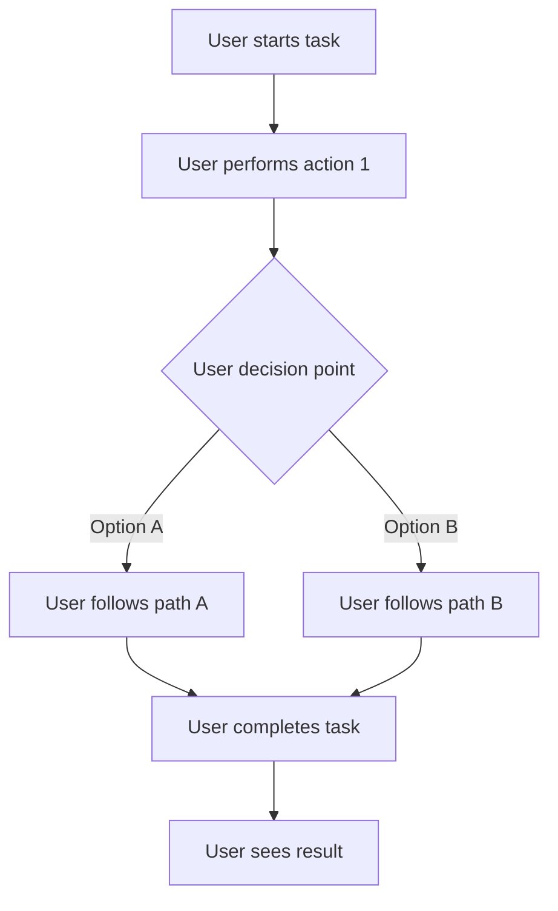
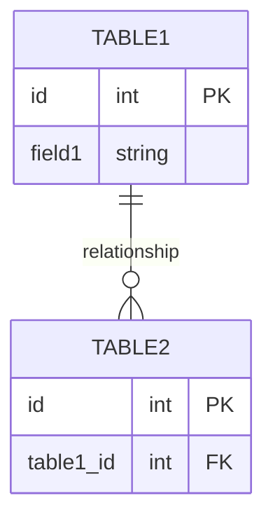

# Task: TASK-ID - TASK-TITLE

## Task Naming Convention
**Follow the TaskHero naming convention when creating tasks:**

**Format:** `TASK-XXX-[TYPE]-descriptive-name.md`

**Where:**
- **XXX** = Sequential number (001, 002, 003, etc.)
- **[TYPE]** = Task type abbreviation (must match metadata Task Type field)
- **descriptive-name** = Brief but clear description (use hyphens, no spaces)

**Task Type Abbreviations:**
- **DEV** = Development
- **BUG** = Bug Fix
- **TEST** = Test Case
- **DOC** = Documentation
- **DES** = Design

**Examples:**
- `TASK-001-DEV-user-authentication.md`
- `TASK-002-BUG-login-validation-error.md`
- `TASK-003-TEST-payment-gateway.md`
- `TASK-004-DOC-api-documentation-update.md`
- `TASK-005-DES-dashboard-ui-redesign.md`

> **Important:** The task type abbreviation in the filename must match the Task Type field in the metadata section below.

## Metadata
- **Priority:** PRIORITY
- **Due:** DUE-DATE
- **Status:** STATUS
- **Assigned to:** ASSIGNEE
- **Task Type:** TASK-TYPE
- **Sequence:** SEQUENCE
- **Estimated Effort:** [Small/Medium/Large]
- **Related Epic/Feature:** [Epic name if applicable]
- **Tags:** TAGS

### Metadata Legend (not to be included in created task, this is for reference only)
- **Priority:** High/Medium/Low - Task urgency and importance level
- **Due:** YYYY-MM-DD - Target completion date
- **Status:** Todo/In Progress/Done/Testing/backlog - Current task state
- **Assigned to:** Developer/Team Member - Person responsible for execution or team
- **Task Type:** DEV/DESIGN/RESEARCH/BUG/TEST - Category of work
- **Sequence:** Number - Order in project timeline
- **Estimated Effort:** Small (1-8h)/Medium (1-3d)/Large (1w+) - Time investment
- **Related Epic/Feature:** Parent feature or epic this task belongs to
- **Tags:** Comma-separated keywords for categorization and filtering

## 1. Overview
### 1.1. Brief Description
[Concise summary of what this task accomplishes and why it's needed]

### 1.2. Functional Requirements
[Specific functionality that must be implemented or changed]
- [Requirement 1]
- [Requirement 2]
- [Requirement 3]

### 1.3. Purpose & Benefits
[Why this task is important and what value it provides]
- [Benefit 1]
- [Benefit 2]
- [Benefit 3]

### 1.4. Success Criteria
- [ ] [Specific success criterion 1]
- [ ] [Specific success criterion 2]
- [ ] [Specific success criterion 3]

## 2. Flow Diagram
**User's perspective of the task flow using Mermaid flowchart:**


[Describe the user journey and key decision points from the user's perspective]

## 3. Implementation Status

### 3.1. Implementation Steps
- [ ] **Step 1: [Main Step Title]** - Status: ⏳ Pending - Target: YYYY-MM-DD
  - [ ] Sub-step 1.1: [Detailed sub-step description]
  - [ ] Sub-step 1.2: [Detailed sub-step description]
  - [ ] Sub-step 1.3: [Detailed sub-step description]
- [ ] **Step 2: [Main Step Title]** - Status: ⏳ Pending - Target: YYYY-MM-DD
  - [ ] Sub-step 2.1: [Detailed sub-step description]
  - [ ] Sub-step 2.2: [Detailed sub-step description]
  - [ ] Sub-step 2.3: [Detailed sub-step description]
- [ ] **Step 3: [Main Step Title]** - Status: ⏳ Pending - Target: YYYY-MM-DD
  - [ ] Sub-step 3.1: [Detailed sub-step description]
  - [ ] Sub-step 3.2: [Detailed sub-step description]
  - [ ] Sub-step 3.3: [Detailed sub-step description]

## 4. Detailed Description
[Detailed description of the task, including its purpose, benefits, and any relevant background information]

**Current Implementation Analysis:**
- [Describe current state/implementation]
- [Key components and their roles]
- [Current limitations or issues]

**New Implementation Features:**
- [Feature 1 and its benefits]
- [Feature 2 and its benefits]
- [Feature 3 and its benefits]

**Migration Strategy:**
- [Approach for transitioning from current to new]
- [Backward compatibility considerations]
- [Risk mitigation strategies]

**Component Mapping:** (if applicable)
| Current Component | New Component | Notes |
|------------------|---------------|-------|
| [Current 1] | [New 1] | [Migration notes] |
| [Current 2] | [New 2] | [Migration notes] |

## 5. Dependencies
### 5.1. Required By This Task
- [Task ID] - [Task Title] - [Status]

### 5.2. Dependent On This Task
- [Task ID] - [Task Title] - [Status]

### 5.3. Technical Dependencies
- [Package/Tool 1] - [Version/Requirement]
- [Package/Tool 2] - [Version/Requirement]

### 5.4. Dependency Type
- **Blocking**: This task cannot start until the dependency is completed
- **Informational**: This task can start but may need information from the dependency
- **Related**: Tasks are related but not directly dependent

## 6. Testing
Testing will be handled in a separate task based on this task summary and requirements.

## 7. UI Design & Specifications
### 7.1. Design Overview
[Brief description of the UI changes and design goals]

### 7.2. Wireframes & Layout
**Use ASCII art for layouts, wireframes, and component positioning:**

```
┌─────────────────────────────────────────────────────────────┐
│ [Page/Component Layout - Use ASCII art for visual layouts]   │
│ ┌─────────────┐ ┌─────────────────────────────────────────┐ │
│ │ Sidebar     │ │ Main Content Area                       │ │
│ │ - Item 1    │ │ ┌─────────────────────────────────────┐ │ │
│ │ - Item 2    │ │ │ Header/Title Section                │ │ │
│ │ - Item 3    │ │ ├─────────────────────────────────────┤ │ │
│ │             │ │ │ Content Block 1                     │ │ │
│ │             │ │ │ Content Block 2                     │ │ │
│ │             │ │ └─────────────────────────────────────┘ │ │
│ └─────────────┘ └─────────────────────────────────────────┘ │
└─────────────────────────────────────────────────────────────┘
```

**ASCII Art Tips:**
- Use `┌─┐└─┘│├─┤` for clean borders and boxes
- Use `═══` for emphasis/headers
- Use `...` for content areas
- Use `[Button]` for interactive elements
- Use `📊📅💳⚙️` emojis for icons and visual elements
- Use `↕↗▼` arrows for sorting and navigation indicators
- Use `🔴🟢` colored circles for status indicators
- Use `^annotations` below diagrams for explanations

### 7.3. Design System References
- **Colors:** [Primary: #color, Secondary: #color, etc.]
- **Typography:** [Font family, sizes, weights]
- **Spacing:** [Padding/margin standards]
- **Components:** [shadcn/ui components used]
- **Icons:** [Icon library and specific icons]

### 7.4. Visual Design References
- [Link to Figma/Design file]
- [Link to existing similar components]
- [Screenshots or mockups if available]

## 8. Risk Assessment
### 8.1. Potential Risks
| Risk | Impact | Probability | Mitigation Strategy |
|------|--------|-------------|-------------------|
| [Risk 1] | [High/Medium/Low] | [High/Medium/Low] | [Mitigation approach] |
| [Risk 2] | [High/Medium/Low] | [High/Medium/Low] | [Mitigation approach] |

## 9. Technical Considerations
[Any technical considerations, potential challenges, or architectural decisions]

**State Management:**
- [State management approach and rationale]
- [Data persistence requirements]
- [State synchronization considerations]

**Component Architecture:**
- [Component structure and organization]
- [Reusability and modularity considerations]
- [Integration patterns with existing codebase]

**Performance Considerations:**
- [Performance requirements and optimizations]
- [Memory management considerations]
- [Loading and rendering optimizations]

**Compatibility:**
- [Browser/platform compatibility requirements]
- [Backward compatibility with existing features]
- [Integration compatibility with external systems]


### 9.2. Database Changes
[If applicable, describe any database schema changes required]



## 10. Time Tracking
- **Estimated hours:** [X]
- **Actual hours:** [To be filled]

## 11. References
- [External Documentation/API Reference 1]
- [External Documentation/API Reference 2]
- [Internal Codebase Reference 1]
- [Internal Codebase Reference 2]
- [Design/Mockup References]
- [Related Tasks/Issues]

## 12. Updates
- [YYYY-MM-DD] - [Update description]
