# TaskHero Database Schema

## Overview

This document defines a comprehensive database schema for TaskHero AI, designed to migrate from the current JSON file-based storage to a SQL-based database management system (MySQL, PostgreSQL, etc.). The schema captures all current functionalities including task management, PRD lifecycle, configuration management, AI operations, and analytics.

## Database Schema Diagram

```mermaid
erDiagram
    %% Core Entities
    PROJECTS {
        int project_id PK
        string project_name
        string description
        string project_root_path
        datetime created_at
        datetime updated_at
        string status "active|archived|deleted"
        json metadata
    }

    USERS {
        int user_id PK
        string username
        string email
        string full_name
        datetime created_at
        datetime last_login
        json preferences
        string status "active|inactive"
    }

    %% Configuration Management
    CONFIGURATIONS {
        int config_id PK
        int project_id FK
        string config_type "global|models|project"
        json config_data
        string version
        datetime created_at
        datetime updated_at
        boolean is_active
    }

    AI_MODELS {
        int model_id PK
        string provider "anthropic|openai|google|perplexity|xai|openrouter"
        string model_name
        string role "main|research|fallback"
        int max_tokens
        decimal temperature
        string base_url
        boolean is_active
        datetime created_at
    }

    %% PRD Management
    PRDS {
        int prd_id PK
        int project_id FK
        string prd_identifier "prd_001"
        string title
        string file_name
        string file_path
        string file_hash
        int file_size
        string status "pending|in-progress|done|archived"
        string complexity "low|medium|high"
        string priority "low|medium|high"
        text description
        json tags
        string estimated_effort
        datetime created_date
        datetime last_modified
        datetime parsed_date
        json metadata
    }

    %% Task Management
    TASKS {
        int task_id PK
        int project_id FK
        int prd_id FK "nullable"
        int parent_task_id FK "nullable for subtasks"
        string task_identifier "1, 1.1, 1.2.1"
        string title
        text description
        text details
        text test_strategy
        string status "pending|in-progress|done|review|blocked|deferred|cancelled"
        string priority "low|medium|high"
        decimal complexity_score "1-10"
        string complexity_level "low|medium|high"
        int estimated_hours
        string assignee
        datetime due_date
        datetime created_at
        datetime updated_at
        json metadata
    }

    TASK_DEPENDENCIES {
        int dependency_id PK
        int task_id FK
        int depends_on_task_id FK
        string dependency_type "blocks|requires|related"
        datetime created_at
    }

    SUBTASKS {
        int subtask_id PK
        int parent_task_id FK
        string subtask_identifier "1.1, 1.2.1"
        string title
        text description
        text details
        string status "pending|in-progress|done|review|blocked|deferred|cancelled"
        json dependencies
        datetime created_at
        datetime updated_at
    }

    %% Analytics and Reporting
    COMPLEXITY_REPORTS {
        int report_id PK
        int project_id FK
        string report_type "task_complexity|prd_analysis"
        json report_data
        int tasks_analyzed
        int threshold_score
        boolean used_research
        datetime generated_at
        string file_path
    }

    TASK_COMPLEXITY_ANALYSIS {
        int analysis_id PK
        int task_id FK
        int report_id FK
        decimal complexity_score
        int recommended_subtasks
        text expansion_prompt
        text reasoning
        datetime analyzed_at
    }

    %% AI Operations and Telemetry
    AI_OPERATIONS {
        int operation_id PK
        int project_id FK
        int user_id FK
        string command_name "parse-prd|add-task|expand|analyze-complexity"
        string model_used
        string provider_name
        int input_tokens
        int output_tokens
        int total_tokens
        decimal total_cost
        string currency
        text prompt_summary
        json response_data
        datetime timestamp
        string status "success|error|timeout"
        text error_message
    }

    %% Session and Audit
    USER_SESSIONS {
        int session_id PK
        int user_id FK
        int project_id FK
        string session_token
        json session_data
        datetime started_at
        datetime last_activity
        datetime ended_at
        string status "active|expired|terminated"
    }

    AUDIT_LOGS {
        int log_id PK
        int user_id FK
        int project_id FK
        string action "create|update|delete|view"
        string entity_type "task|prd|config"
        int entity_id
        json old_values
        json new_values
        string ip_address
        string user_agent
        datetime timestamp
    }

    %% Kanban and UI State
    KANBAN_BOARDS {
        int board_id PK
        int project_id FK
        string board_name
        text description
        json column_config
        json board_settings
        datetime created_at
        datetime updated_at
        boolean is_active
    }

    KANBAN_COLUMNS {
        int column_id PK
        int board_id FK
        string column_name
        string status_mapping
        int sort_order
        string color_theme
        json column_settings
    }

    TASK_BOARD_POSITIONS {
        int position_id PK
        int task_id FK
        int board_id FK
        int column_id FK
        int sort_order
        datetime moved_at
        int moved_by_user_id FK
    }

    %% File Management and Attachments
    FILE_ATTACHMENTS {
        int attachment_id PK
        int task_id FK "nullable"
        int prd_id FK "nullable"
        string file_name
        string file_path
        string file_type
        int file_size
        string mime_type
        string file_hash
        datetime uploaded_at
        int uploaded_by_user_id FK
    }

    %% Testing and Quality Assurance
    TEST_CASES {
        int test_case_id PK
        int task_id FK
        string test_type "unit|integration|e2e|manual"
        string test_name
        text test_description
        text test_steps
        text expected_result
        string status "pending|passed|failed|skipped"
        datetime created_at
        datetime last_run
        int created_by_user_id FK
    }

    TEST_RESULTS {
        int result_id PK
        int test_case_id FK
        string result_status "passed|failed|skipped"
        text actual_result
        text error_message
        decimal execution_time
        datetime executed_at
        int executed_by_user_id FK
    }

    %% Relationships
    PROJECTS ||--o{ PRDS : contains
    PROJECTS ||--o{ TASKS : contains
    PROJECTS ||--o{ CONFIGURATIONS : has
    PROJECTS ||--o{ KANBAN_BOARDS : has
    PROJECTS ||--o{ AI_OPERATIONS : tracks
    PROJECTS ||--o{ COMPLEXITY_REPORTS : generates

    USERS ||--o{ USER_SESSIONS : creates
    USERS ||--o{ AUDIT_LOGS : performs
    USERS ||--o{ AI_OPERATIONS : executes

    PRDS ||--o{ TASKS : generates
    PRDS ||--o{ FILE_ATTACHMENTS : has

    TASKS ||--o{ SUBTASKS : contains
    TASKS ||--o{ TASK_DEPENDENCIES : has_dependencies
    TASKS ||--o{ TASK_DEPENDENCIES : blocks_other_tasks
    TASKS ||--o{ TASK_COMPLEXITY_ANALYSIS : analyzed_in
    TASKS ||--o{ TASK_BOARD_POSITIONS : positioned_on
    TASKS ||--o{ TEST_CASES : tested_by
    TASKS ||--o{ FILE_ATTACHMENTS : has

    KANBAN_BOARDS ||--o{ KANBAN_COLUMNS : contains
    KANBAN_COLUMNS ||--o{ TASK_BOARD_POSITIONS : contains

    COMPLEXITY_REPORTS ||--o{ TASK_COMPLEXITY_ANALYSIS : contains

    TEST_CASES ||--o{ TEST_RESULTS : produces
```

## Key Design Principles

### 1. **Scalability**
- Separate tables for different entity types to allow independent scaling
- Indexed foreign keys for efficient joins
- JSON columns for flexible metadata storage

### 2. **Data Integrity**
- Foreign key constraints to maintain referential integrity
- Enum constraints for status fields
- Audit trail for all critical operations

### 3. **Flexibility**
- JSON metadata columns for extensible data storage
- Configurable kanban board structures
- Support for multiple AI providers and models

### 4. **Performance**
- Optimized for common query patterns (tasks by project, PRDs by status)
- Separate tables for large text content (details, descriptions)
- Efficient indexing strategy for search and filtering

## Migration Considerations

### From JSON to SQL
1. **Data Transformation**: Current JSON structures map directly to table rows
2. **Relationship Extraction**: Dependencies and references become foreign keys
3. **Metadata Preservation**: Complex nested data stored in JSON columns
4. **File Path Management**: Absolute paths converted to relative with base path configuration

### Backward Compatibility
- Maintain JSON export functionality for existing integrations
- API layer abstracts database changes from CLI and web interfaces
- Configuration migration tools for seamless transition

This schema provides a solid foundation for migrating TaskHero from file-based storage to a robust, scalable database system while preserving all current functionality and enabling future enhancements.
